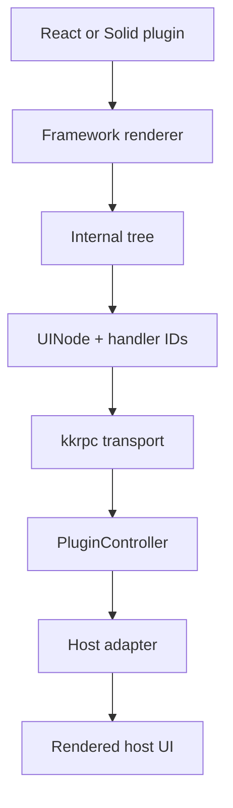
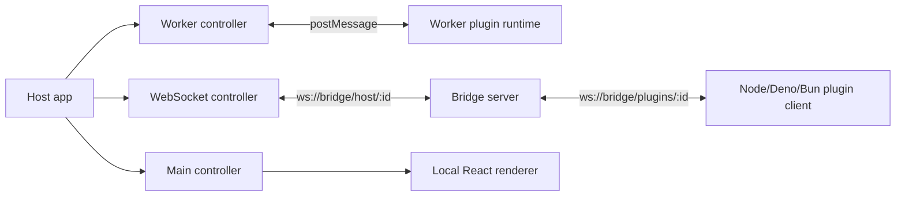

# Architecture

<cite>
**Referenced Files in This Document**
- [README.md](file://README.md#L6-L27)
- [AGENTS.md](file://AGENTS.md#L7-L39)
- [packages/protocol/src/rpc.ts](file://packages/protocol/src/rpc.ts#L9-L81)
- [packages/protocol/src/tree.ts](file://packages/protocol/src/tree.ts#L104-L129)
- [packages/host-sdk/src/types.ts](file://packages/host-sdk/src/types.ts#L3-L65)
- [packages/react-runtime/src/runtime.ts](file://packages/react-runtime/src/runtime.ts#L75-L159)
- [packages/host-svelte/src/PluginHost.svelte](file://packages/host-svelte/src/PluginHost.svelte#L8-L51)
</cite>

## Table of Contents

1. [System Shape](#system-shape)
2. [Core Design Principles](#core-design-principles)
3. [Runtime Boundaries](#runtime-boundaries)
4. [Documentation Map](#documentation-map)

## System Shape

Uniview is a protocol-first plugin system. Plugin authors write React or Solid components, runtime packages render those components into an in-memory tree, `@uniview/protocol` defines the serializable `UINode` contract, and host adapters render that contract in Svelte, React, Vue, or other environments. The design keeps plugin code out of the host framework and lets transports vary between Web Worker `postMessage`, WebSocket bridge traffic, and development-only main-thread execution.

**Diagram sources**

- [README.md](file://README.md#L6-L27)
- [AGENTS.md](file://AGENTS.md#L7-L39)
- [packages/protocol/src/tree.ts](file://packages/protocol/src/tree.ts#L104-L129)
- [packages/host-sdk/src/types.ts](file://packages/host-sdk/src/types.ts#L5-L52)

**Section sources**

- [README.md](file://README.md#L6-L27)
- [AGENTS.md](file://AGENTS.md#L7-L39)

## Core Design Principles

The architecture is intentionally split into small packages with stable seams:

| Principle | Implementation |
| --- | --- |
| Protocol-first | Cross-boundary data is described by `UINode`, `JSONValue`, mutations, events, and RPC interfaces. |
| Framework isolation | Renderers understand React or Solid internals; hosts only receive protocol trees. |
| Handler registry | Function props become handler IDs before crossing RPC. |
| Transport abstraction | Controllers expose one `PluginController` interface for Worker, WebSocket, and main-thread modes. |
| Host extensibility | Hosts use `ComponentRegistry` to map product primitives such as `Button` and `Input` to native components. |

The protocol API currently includes `initialize`, `updateProps`, `executeHandler`, `destroy`, and `syncTree` from host to plugin, and `updateTree`, `applyMutations`, `log`, and `reportError` from plugin to host.

**Section sources**

- [packages/protocol/src/rpc.ts](file://packages/protocol/src/rpc.ts#L9-L81)
- [packages/protocol/src/tree.ts](file://packages/protocol/src/tree.ts#L104-L129)
- [packages/host-sdk/src/types.ts](file://packages/host-sdk/src/types.ts#L5-L65)

## Runtime Boundaries

Runtime modes differ only in the transport and isolation boundary. Worker mode uses a browser Web Worker, WebSocket mode connects plugin processes to the bridge server, and main-thread mode bypasses RPC for development. Plugin runtime code still exposes the same host-facing API and performs protocol version checks before rendering.

**Diagram sources**

- [packages/host-sdk/src/types.ts](file://packages/host-sdk/src/types.ts#L3-L52)
- [packages/react-runtime/src/runtime.ts](file://packages/react-runtime/src/runtime.ts#L75-L159)
- [packages/host-svelte/src/PluginHost.svelte](file://packages/host-svelte/src/PluginHost.svelte#L23-L51)

**Section sources**

- [packages/react-runtime/src/runtime.ts](file://packages/react-runtime/src/runtime.ts#L75-L159)
- [packages/host-sdk/src/types.ts](file://packages/host-sdk/src/types.ts#L3-L52)

## Documentation Map

Use the architecture subpages for deeper dives: [Monorepo Architecture](./Monorepo%20Architecture.md) covers package/workspace boundaries, [RPC Protocol](./RPC%20Protocol.md) covers bidirectional method contracts, [Data Flow](./Data%20Flow.md) follows tree and event propagation, and [Runtime Modes](./Runtime%20Modes.md) compares Worker, WebSocket, and main-thread execution.

**Section sources**

- [AGENTS.md](file://AGENTS.md#L41-L64)
- [README.md](file://README.md#L217-L245)
