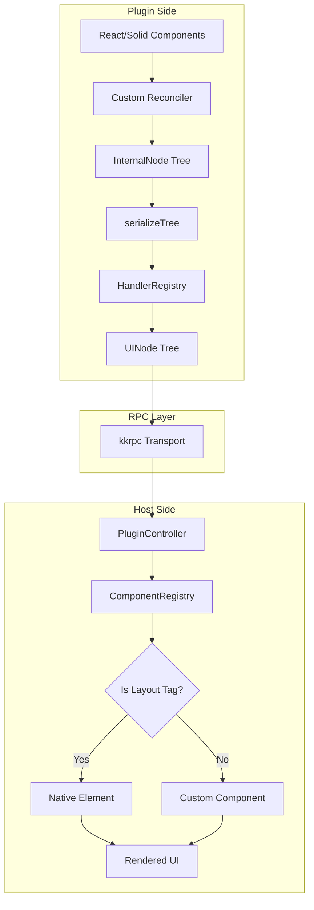
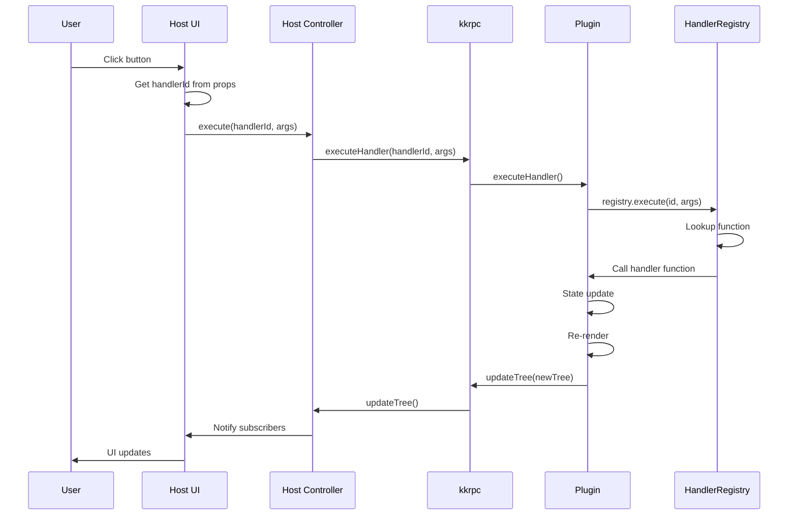
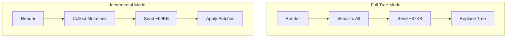

# Data Flow

<cite>
**Referenced Files in This Document**
- [AGENTS.md](file://AGENTS.md)
- [packages/react-renderer/src/index.ts](file://packages/react-renderer/src/index.ts)
- [packages/host-sdk/src/index.ts](file://packages/host-sdk/src/index.ts)
- [README.md](file://README.md)
</cite>

## Table of Contents

1. [Overview](#overview)
2. [Plugin to Host Flow](#plugin-to-host-flow)
3. [Event Flow](#event-flow)
4. [Incremental Updates](#incremental-updates)

## Overview

Data flows bidirectionally between plugin and host:

- **Forward**: React/Solid components → UINode tree → RPC → Host rendering
- **Reverse**: User interaction → Handler ID → RPC → Handler execution → State update

**Section sources**

- [AGENTS.md](file://AGENTS.md#L336-L342)

## Plugin to Host Flow



### Step-by-Step

1. **React/Solid renders**: Component tree produced by framework
2. **Custom reconciler**: Converts to `InternalNode` in-memory tree
3. **Serialization**: `serializeTree()` converts to JSON-safe `UINode`
4. **Handler mapping**: Functions replaced with handler IDs
5. **RPC transport**: kkrpc sends tree to host
6. **Host receives**: `PluginController` updates internal tree
7. **Component resolution**: `ComponentRegistry` maps types to implementations
8. **Rendering**: Framework-specific renderer produces UI

**Section sources**

- [AGENTS.md](file://AGENTS.md#L336-L342)
- [packages/react-renderer/src/index.ts](file://packages/react-renderer/src/index.ts)

## Event Flow



### Handler Execution

```typescript
// Host side
button.onclick = () => {
  const handlerId = props._onClickHandlerId;
  controller.execute(handlerId, [event]);
};

// Plugin side
registry.register(() => {
  setCount((c) => c + 1); // State update triggers re-render
});
```

**Section sources**

- [AGENTS.md](file://AGENTS.md#L138-L149)

## Incremental Updates

For large trees with small changes, incremental mode reduces bandwidth:



### Mutation Collection

```typescript
// During reconciliation
appendChild(parent, child); // → AppendChildMutation
removeChild(parent, child); // → RemoveChildMutation
commitUpdate(node, newProps); // → SetPropsMutation
```

### Performance Comparison (1000 items)

| Metric         | Full Tree | Incremental |
| -------------- | --------- | ----------- |
| Message size   | ~87KB     | ~69KB       |
| Operation time | 8-10ms    | 6-7ms       |
| Bandwidth      | Higher    | Lower       |

**Section sources**

- [packages/protocol/src/mutations.ts](file://packages/protocol/src/mutations.ts)
- [README.md](file://README.md#L151-L169)
