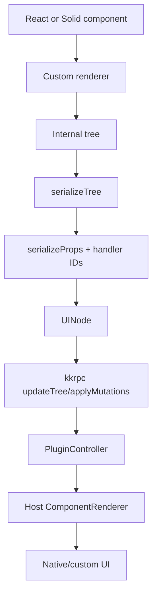
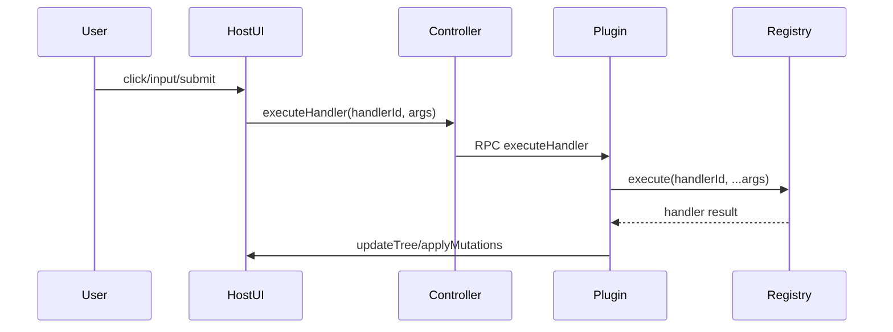

# Data Flow

<cite>
**Referenced Files in This Document**
- [packages/react-renderer/src/reconciler/renderer.ts](file://packages/react-renderer/src/reconciler/renderer.ts#L1-L38)
- [packages/react-renderer/src/serialization/serialize.ts](file://packages/react-renderer/src/serialization/serialize.ts#L1-L44)
- [packages/react-renderer/src/serialization/serialize-props.ts](file://packages/react-renderer/src/serialization/serialize-props.ts#L1-L45)
- [packages/react-renderer/src/mutation/mutation-collector.ts](file://packages/react-renderer/src/mutation/mutation-collector.ts#L24-L241)
- [packages/react-runtime/src/runtime.ts](file://packages/react-runtime/src/runtime.ts#L75-L159)
- [packages/host-sdk/src/controllers/worker.ts](file://packages/host-sdk/src/controllers/worker.ts#L32-L148)
- [packages/host-sdk/src/mutable-tree.ts](file://packages/host-sdk/src/mutable-tree.ts#L32-L64)
- [packages/host-svelte/src/ComponentRenderer.svelte](file://packages/host-svelte/src/ComponentRenderer.svelte#L15-L246)
</cite>

## Table of Contents

1. [Overview](#overview)
2. [Plugin-to-Host Tree Flow](#plugin-to-host-tree-flow)
3. [Host-to-Plugin Event Flow](#host-to-plugin-event-flow)
4. [Incremental Update Flow](#incremental-update-flow)

## Overview

Data moves in two directions. Forward flow turns framework components into a serializable `UINode` tree and renders it in the host. Reverse flow turns user events into handler ID calls that execute inside the plugin runtime, causing framework state updates and new tree output.

**Section sources**

- [packages/react-runtime/src/runtime.ts](file://packages/react-runtime/src/runtime.ts#L75-L159)
- [packages/host-svelte/src/ComponentRenderer.svelte](file://packages/host-svelte/src/ComponentRenderer.svelte#L15-L246)

## Plugin-to-Host Tree Flow

```mermaid
flowchart TD
    React[React or Solid component] --> Renderer[Custom renderer]
    Renderer --> Internal[Internal tree]
    Internal --> Serialize[serializeTree]
    Serialize --> Props[serializeProps + handler IDs]
    Props --> UINode[UINode]
    UINode --> RPC[kkrpc updateTree/applyMutations]
    RPC --> Controller[PluginController]
    Controller --> HostRenderer[Host ComponentRenderer]
    HostRenderer --> UI[Native/custom UI]
```

**Diagram sources**

- [packages/react-renderer/src/reconciler/renderer.ts](file://packages/react-renderer/src/reconciler/renderer.ts#L1-L38)
- [packages/react-renderer/src/serialization/serialize.ts](file://packages/react-renderer/src/serialization/serialize.ts#L15-L44)
- [packages/react-renderer/src/serialization/serialize-props.ts](file://packages/react-renderer/src/serialization/serialize-props.ts#L10-L45)

**Section sources**

- [packages/react-renderer/src/reconciler/renderer.ts](file://packages/react-renderer/src/reconciler/renderer.ts#L1-L38)
- [packages/react-runtime/src/runtime.ts](file://packages/react-runtime/src/runtime.ts#L82-L115)
- [packages/host-sdk/src/controllers/worker.ts](file://packages/host-sdk/src/controllers/worker.ts#L32-L49)

## Host-to-Plugin Event Flow

Host renderers detect handler ID props, build serializable event arguments, and call `controller.executeHandler(handlerId, args)`. The controller forwards the call over RPC; the plugin runtime calls `HandlerRegistry.execute`, and framework state changes trigger a new render.

```mermaid
sequenceDiagram
    participant User
    participant HostUI
    participant Controller
    participant Plugin
    participant Registry
    User->>HostUI: click/input/submit
    HostUI->>Controller: executeHandler(handlerId, args)
    Controller->>Plugin: RPC executeHandler
    Plugin->>Registry: execute(handlerId, ...args)
    Registry-->>Plugin: handler result
    Plugin->>HostUI: updateTree/applyMutations
```

**Diagram sources**

- [packages/host-svelte/src/ComponentRenderer.svelte](file://packages/host-svelte/src/ComponentRenderer.svelte#L18-L22)
- [packages/host-svelte/src/ComponentRenderer.svelte](file://packages/host-svelte/src/ComponentRenderer.svelte#L38-L118)
- [packages/react-runtime/src/runtime.ts](file://packages/react-runtime/src/runtime.ts#L132-L135)

**Section sources**

- [packages/host-svelte/src/ComponentRenderer.svelte](file://packages/host-svelte/src/ComponentRenderer.svelte#L38-L166)
- [packages/host-sdk/src/controllers/worker.ts](file://packages/host-sdk/src/controllers/worker.ts#L134-L138)
- [packages/react-runtime/src/runtime.ts](file://packages/react-runtime/src/runtime.ts#L132-L135)

## Incremental Update Flow

Incremental mode attaches a mutation collector during rendering. The runtime sends mutation batches through `applyMutations`, and host controllers use `MutableTree` to update local state and notify subscribers. Full sync remains available through `syncTree()` for recovery from drift.

**Section sources**

- [packages/react-renderer/src/mutation/mutation-collector.ts](file://packages/react-renderer/src/mutation/mutation-collector.ts#L24-L241)
- [packages/react-runtime/src/runtime.ts](file://packages/react-runtime/src/runtime.ts#L82-L96)
- [packages/host-sdk/src/mutable-tree.ts](file://packages/host-sdk/src/mutable-tree.ts#L32-L64)
- [packages/host-sdk/src/controllers/worker.ts](file://packages/host-sdk/src/controllers/worker.ts#L113-L118)
