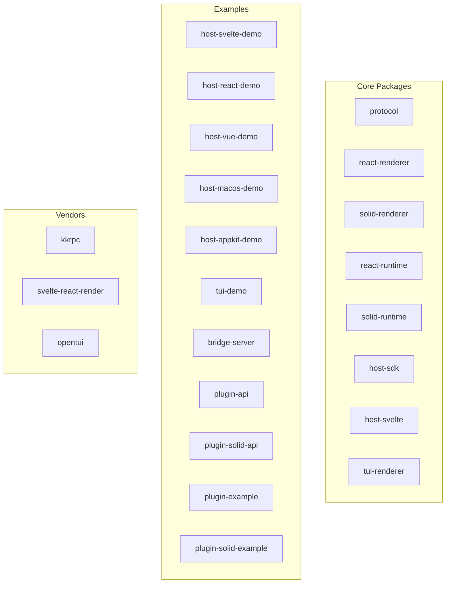
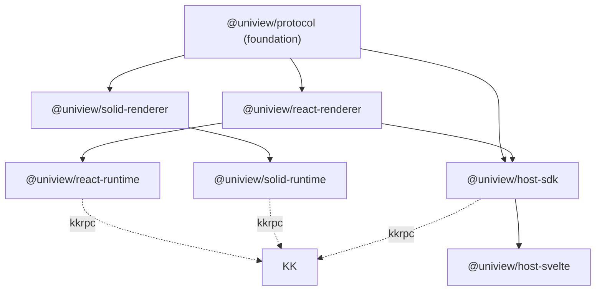
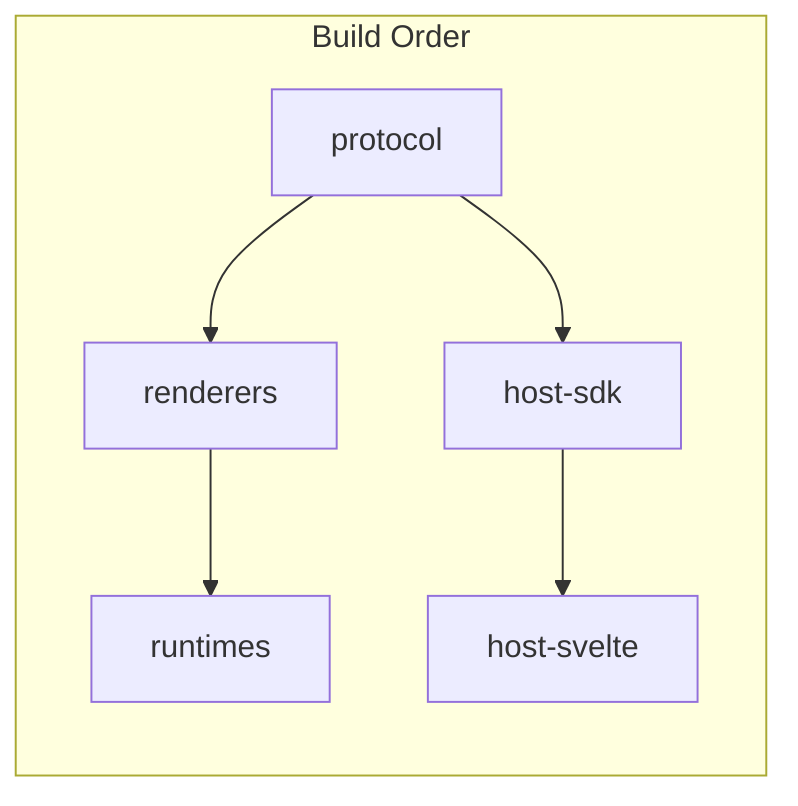

# Monorepo Architecture

<cite>
**Referenced Files in This Document**
- [pnpm-workspace.yaml](file://pnpm-workspace.yaml)
- [turbo.json](file://turbo.json)
- [package.json](file://package.json)
- [AGENTS.md](file://AGENTS.md)
</cite>

## Table of Contents

1. [Overview](#overview)
2. [Package Structure](#package-structure)
3. [Dependency Graph](#dependency-graph)
4. [Build Orchestration](#build-orchestration)
5. [Catalog Management](#catalog-management)

## Overview

Uniview is organized as a pnpm monorepo with turbo for build orchestration. The workspace contains 8 core packages, 11 example applications, and vendor submodules.

**Section sources**

- [pnpm-workspace.yaml](file://pnpm-workspace.yaml)
- [AGENTS.md](file://AGENTS.md#L11-L36)

## Package Structure



### Package Categories

| Category        | Packages                           | Purpose                                |
| --------------- | ---------------------------------- | -------------------------------------- |
| **Protocol**    | `@uniview/protocol`                | Type definitions, RPC interfaces       |
| **Renderers**   | `react-renderer`, `solid-renderer` | Convert framework trees to UINode      |
| **Runtimes**    | `react-runtime`, `solid-runtime`   | Bootstrap plugins in Workers/WebSocket |
| **Host**        | `host-sdk`, `host-svelte`          | Control plugins, render UINode trees   |
| **Alternative** | `tui-renderer`                     | Terminal UI rendering                  |

**Section sources**

- [AGENTS.md](file://AGENTS.md#L12-L36)
- [README.md](file://README.md#L197-L219)

## Dependency Graph



### Key Dependency Rules

1. **Protocol is the foundation**: All packages depend on `@uniview/protocol`
2. **Renderers depend on protocol only**: No host dependencies
3. **Runtimes depend on renderers**: Bootstrap uses renderer + kkrpc
4. **Host SDK depends on renderers**: For type definitions
5. **Host adapters depend on SDK**: Framework-specific implementations

**Section sources**

- [AGENTS.md](file://AGENTS.md#L38-L50)
- [AGENTS.md](file://AGENTS.md#L52-L61)

## Build Orchestration

### Turbo Tasks

```json
{
  "tasks": {
    "build": {
      "dependsOn": ["^build"],
      "inputs": ["$TURBO_DEFAULT$", ".env*"],
      "outputs": ["dist/**", ".next/**", ".svelte-kit/**"]
    },
    "lint": { "dependsOn": ["^lint"] },
    "check-types": { "dependsOn": ["^check-types"] },
    "dev": { "cache": false, "persistent": true }
  }
}
```

### Task Dependencies



The `^build` syntax means "build all dependencies first". Turbo automatically parallelizes independent packages.

**Section sources**

- [turbo.json](file://turbo.json)
- [package.json](file://package.json#L4-L10)

## Catalog Management

### Version Catalog

```yaml
# pnpm-workspace.yaml
catalog:
  kkrpc: ^0.6.7
  react: ^19.2.4
  react-reconciler: ^0.33.0
```

### Usage in Packages

```json
{
  "dependencies": {
    "kkrpc": "catalog:",
    "react": "catalog:"
  }
}
```

### Benefits

| Feature                    | Benefit                                  |
| -------------------------- | ---------------------------------------- |
| **Single source of truth** | All packages use same kkrpc version      |
| **Easy upgrades**          | Change catalog once, all packages update |
| **Consistency**            | No version drift across packages         |

**Section sources**

- [pnpm-workspace.yaml](file://pnpm-workspace.yaml#L7-L10)
- [AGENTS.md](file://AGENTS.md#L169-L174)
