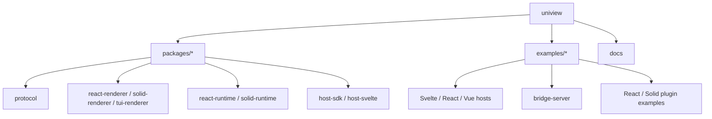

# Monorepo Architecture

<cite>
**Referenced Files in This Document**
- [pnpm-workspace.yaml](file://pnpm-workspace.yaml#L1-L9)
- [turbo.json](file://turbo.json#L1-L25)
- [package.json](file://package.json#L4-L40)
- [README.md](file://README.md#L28-L40)
- [AGENTS.md](file://AGENTS.md#L11-L39)
- [packages/react-runtime/package.json](file://packages/react-runtime/package.json#L29-L43)
- [packages/react-renderer/package.json](file://packages/react-renderer/package.json#L28-L44)
</cite>

## Table of Contents

1. [Overview](#overview)
2. [Workspace Layout](#workspace-layout)
3. [Dependency Graph](#dependency-graph)
4. [Build Orchestration](#build-orchestration)
5. [Catalog Management](#catalog-management)

## Overview

Uniview is a pnpm workspace with three top-level workspace globs: reusable packages, runnable examples, and the documentation app. Turbo coordinates cross-package tasks, while package manifests keep runtime dependencies explicit and local.

**Section sources**

- [pnpm-workspace.yaml](file://pnpm-workspace.yaml#L1-L9)
- [package.json](file://package.json#L4-L40)
- [AGENTS.md](file://AGENTS.md#L11-L39)

## Workspace Layout

```mermaid
graph TB
    Root[uniview]
    Root --> Packages[packages/*]
    Root --> Examples[examples/*]
    Root --> Docs[docs]
    Packages --> Protocol[protocol]
    Packages --> Renderers[react-renderer / solid-renderer / tui-renderer]
    Packages --> Runtimes[react-runtime / solid-runtime]
    Packages --> Host[host-sdk / host-svelte]
    Examples --> WebHosts[Svelte / React / Vue hosts]
    Examples --> Bridge[bridge-server]
    Examples --> Plugins[React / Solid plugin examples]
```

**Diagram sources**

- [pnpm-workspace.yaml](file://pnpm-workspace.yaml#L1-L9)
- [AGENTS.md](file://AGENTS.md#L11-L39)

**Section sources**

- [README.md](file://README.md#L28-L40)
- [AGENTS.md](file://AGENTS.md#L11-L39)

## Dependency Graph

Protocol is the foundation package. Renderers depend on protocol, runtimes depend on renderers and kkrpc, and host adapters depend on the host SDK. This keeps product-specific primitives in examples/host registries rather than in the protocol package.

```mermaid
graph TD
    Protocol[@uniview/protocol]
    Protocol --> ReactRenderer[react-renderer]
    Protocol --> SolidRenderer[solid-renderer]
    ReactRenderer --> ReactRuntime[react-runtime]
    SolidRenderer --> SolidRuntime[solid-runtime]
    Protocol --> HostSDK[host-sdk]
    ReactRenderer --> HostSDK
    HostSDK --> HostSvelte[host-svelte]
```

**Diagram sources**

- [README.md](file://README.md#L28-L40)
- [AGENTS.md](file://AGENTS.md#L41-L64)

**Section sources**

- [README.md](file://README.md#L28-L40)
- [AGENTS.md](file://AGENTS.md#L41-L64)

## Build Orchestration

Turbo declares dependency-aware build, lint, type-check, test, and development tasks. `build` depends on upstream builds and records `dist`, `.next`, and `.svelte-kit` outputs; `check-types` depends on upstream builds and type-checks; `test` depends on upstream builds; `dev` is persistent and uncached.

**Section sources**

- [turbo.json](file://turbo.json#L1-L25)
- [package.json](file://package.json#L4-L16)

## Catalog Management

The pnpm catalog pins shared versions for `kkrpc`, `react`, and `react-reconciler`. Packages reference these as `catalog:` dependencies, which keeps transport and framework versions consistent across the monorepo.

**Section sources**

- [pnpm-workspace.yaml](file://pnpm-workspace.yaml#L6-L9)
- [packages/react-runtime/package.json](file://packages/react-runtime/package.json#L29-L43)
- [packages/react-renderer/package.json](file://packages/react-renderer/package.json#L28-L44)
