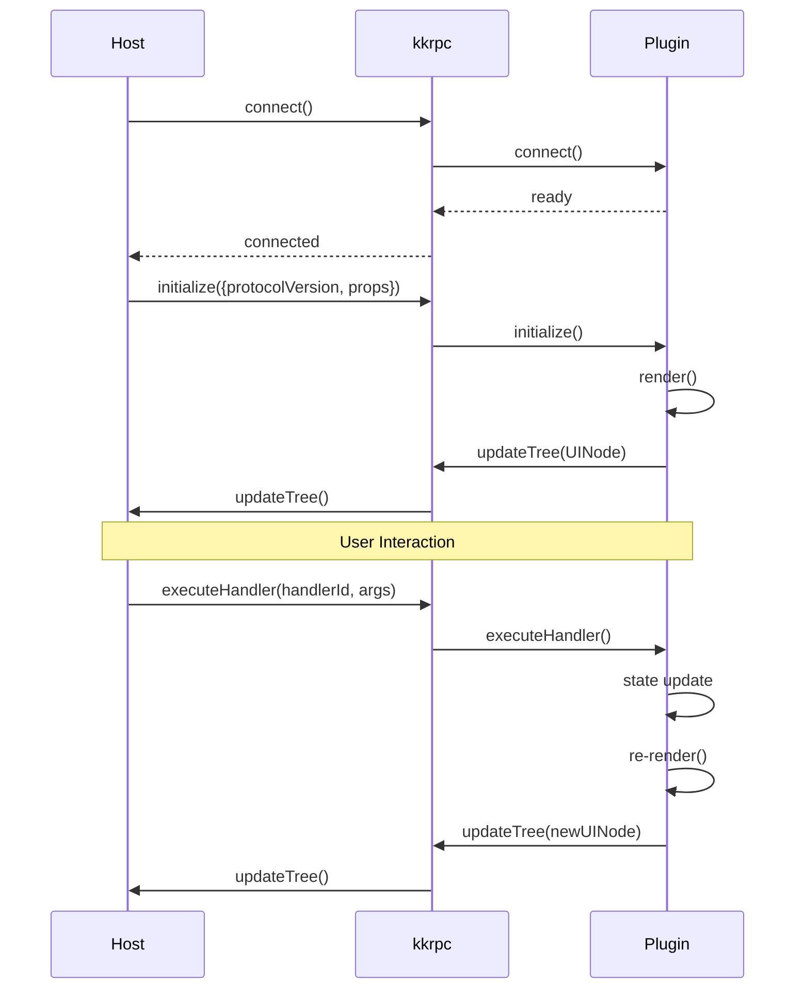
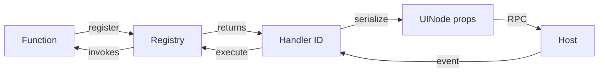

# RPC Protocol

<cite>
**Referenced Files in This Document**
- [packages/protocol/src/rpc.ts](file://packages/protocol/src/rpc.ts)
- [packages/protocol/src/tree.ts](file://packages/protocol/src/tree.ts)
- [packages/protocol/src/events.ts](file://packages/protocol/src/events.ts)
- [packages/protocol/src/mutations.ts](file://packages/protocol/src/mutations.ts)
- [AGENTS.md](file://AGENTS.md)
</cite>

## Table of Contents

1. [Overview](#overview)
2. [Communication Sequence](#communication-sequence)
3. [HostToPluginAPI](#hosttopluginapi)
4. [PluginToHostAPI](#plugintohostapi)
5. [UINode Tree Structure](#uinode-tree-structure)
6. [Handler Registry Pattern](#handler-registry-pattern)
7. [Mutations](#mutations)

## Overview

The RPC protocol defines the communication contract between plugins and hosts. It uses kkrpc for transport and follows a bidirectional API pattern where:

- **Host** calls methods on **Plugin** via `HostToPluginAPI`
- **Plugin** calls methods on **Host** via `PluginToHostAPI`

**Section sources**

- [packages/protocol/src/rpc.ts](file://packages/protocol/src/rpc.ts#L1-L8)
- [AGENTS.md](file://AGENTS.md#L127-L136)

## Communication Sequence



**Diagram sources**

- [packages/protocol/src/rpc.ts](file://packages/protocol/src/rpc.ts#L9-L88)

## HostToPluginAPI

Methods the host calls on the plugin:

```typescript
interface HostToPluginAPI {
  // Lifecycle
  initialize(req: {
    protocolVersion: number;
    props?: JSONValue;
  }): Promise<void>;
  updateProps(props: JSONValue): Promise<void>;
  destroy(): Promise<void>;

  // Events
  executeHandler(handlerId: HandlerId, args: JSONValue[]): Promise<void>;

  // Benchmarking
  updateItem(itemId: string, text: string): Promise<void>;
  syncTree(): Promise<void>;
}
```

### Method Details

| Method           | Purpose                     | When Called             |
| ---------------- | --------------------------- | ----------------------- |
| `initialize`     | Bootstrap plugin with props | Once on connection      |
| `updateProps`    | Update plugin props         | When host state changes |
| `executeHandler` | Trigger event handler       | On user interaction     |
| `destroy`        | Clean up resources          | On disconnect           |
| `updateItem`     | Update specific list item   | Benchmark mode          |
| `syncTree`       | Request full tree sync      | Recovery from drift     |

**Section sources**

- [packages/protocol/src/rpc.ts](file://packages/protocol/src/rpc.ts#L9-L48)

## PluginToHostAPI

Methods the plugin calls on the host:

```typescript
interface PluginToHostAPI {
  // UI Updates
  updateTree(tree: UINode | null): void;
  applyMutations(mutations: Mutation[]): void;

  // Logging
  log(level: "log" | "info" | "warn" | "error", args: JSONValue[]): void;
  reportError(err: { message: string; stack?: string }): void;
}
```

### Update Modes

| Mode            | Method           | Description                      |
| --------------- | ---------------- | -------------------------------- |
| **Full**        | `updateTree`     | Send entire tree on every render |
| **Incremental** | `applyMutations` | Send only changes                |

**Section sources**

- [packages/protocol/src/rpc.ts](file://packages/protocol/src/rpc.ts#L50-L88)

## UINode Tree Structure

```typescript
interface UINode {
  id: string; // Unique identifier for reconciliation
  type: string; // Layout tag OR custom component type
  props: Record<string, JSONValue>; // JSON-serializable props only
  children: (UINode | string)[]; // Nested nodes or text
}
```

### JSONValue Type

```typescript
type JSONValue =
  | null
  | boolean
  | number
  | string
  | JSONValue[]
  | { [k: string]: JSONValue };
```

### Layout Tags

Built-in HTML-like elements all hosts must support:

```typescript
type UILayoutTag =
  | "div"
  | "span"
  | "p"
  | "section"
  | "header"
  | "footer"
  | "nav"
  | "main"
  | "ul"
  | "ol"
  | "li"
  | "h1"
  | "h2"
  | "h3"
  | "h4"
  | "h5"
  | "h6"
  | "button"
  | "input"
  | "textarea"
  | "select"
  | "label"
  | "form"
  | "a"
  | "img"
  | "table"
  | "thead"
  | "tbody"
  | "tr"
  | "th"
  | "td"
  | "strong"
  | "em"
  | "code"
  | "pre";
```

**Section sources**

- [packages/protocol/src/tree.ts](file://packages/protocol/src/tree.ts#L1-L130)

## Handler Registry Pattern

Functions cannot be serialized over RPC. The handler registry pattern solves this:



### Event Prop Mapping

| Event Prop | Handler ID Prop      |
| ---------- | -------------------- |
| `onClick`  | `_onClickHandlerId`  |
| `onChange` | `_onChangeHandlerId` |
| `onInput`  | `_onInputHandlerId`  |
| `onSubmit` | `_onSubmitHandlerId` |
| `onFocus`  | `_onFocusHandlerId`  |
| `onBlur`   | `_onBlurHandlerId`   |

### Helper Functions

```typescript
handlerIdProp("onClick"); // "_onClickHandlerId"
isHandlerIdProp("_onClickHandlerId"); // true
extractEventName("_onClickHandlerId"); // "onClick"
```

**Section sources**

- [packages/protocol/src/events.ts](file://packages/protocol/src/events.ts)
- [AGENTS.md](file://AGENTS.md#L138-L149)

## Mutations

For incremental updates, mutations describe tree changes:

```typescript
type Mutation =
  | AppendChildMutation
  | InsertBeforeMutation
  | RemoveChildMutation
  | SetTextMutation
  | SetPropsMutation
  | SetRootMutation;
```

### Mutation Types

| Type           | Purpose                     |
| -------------- | --------------------------- |
| `appendChild`  | Add node to parent          |
| `insertBefore` | Insert at specific position |
| `removeChild`  | Remove node from parent     |
| `setText`      | Update text content         |
| `setProps`     | Update node props           |
| `setRoot`      | Replace entire root         |

**Section sources**

- [packages/protocol/src/mutations.ts](file://packages/protocol/src/mutations.ts)
