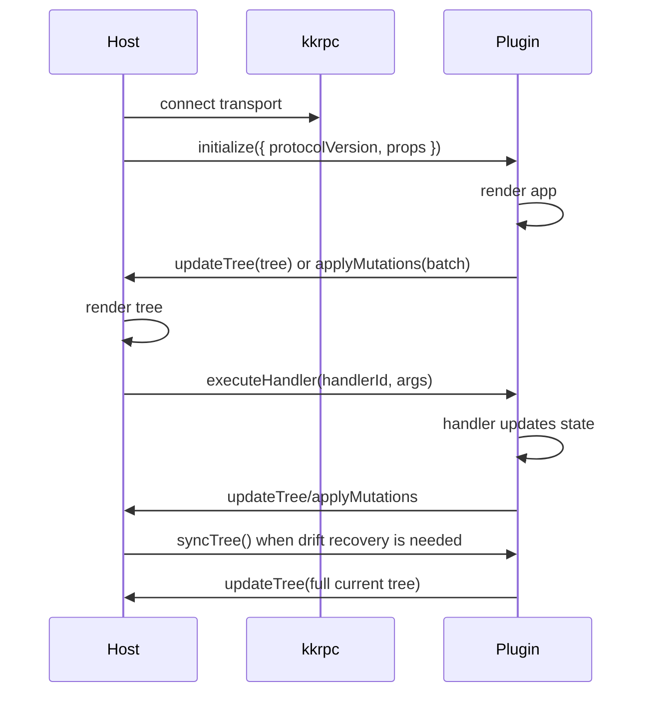
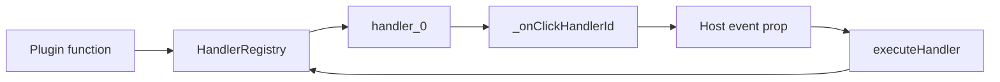

# RPC Protocol

<cite>
**Referenced Files in This Document**
- [packages/protocol/src/rpc.ts](file://packages/protocol/src/rpc.ts#L9-L81)
- [packages/protocol/src/tree.ts](file://packages/protocol/src/tree.ts#L4-L129)
- [packages/protocol/src/events.ts](file://packages/protocol/src/events.ts#L1-L72)
- [packages/protocol/src/mutations.ts](file://packages/protocol/src/mutations.ts#L3-L81)
- [packages/protocol/src/version.ts](file://packages/protocol/src/version.ts#L1-L5)
- [packages/react-runtime/src/runtime.ts](file://packages/react-runtime/src/runtime.ts#L48-L159)
- [packages/react-runtime/tests/protocol-contract.test.ts](file://packages/react-runtime/tests/protocol-contract.test.ts#L4-L28)
- [packages/host-sdk/src/controllers/worker.ts](file://packages/host-sdk/src/controllers/worker.ts#L32-L148)
- [packages/host-sdk/src/mutable-tree.ts](file://packages/host-sdk/src/mutable-tree.ts#L32-L64)
- [packages/react-renderer/src/serialization/serialize-props.ts](file://packages/react-renderer/src/serialization/serialize-props.ts#L22-L31)
- [packages/react-renderer/src/serialization/handler-registry.ts](file://packages/react-renderer/src/serialization/handler-registry.ts#L1-L42)
</cite>

## Table of Contents

1. [Overview](#overview)
2. [Communication Sequence](#communication-sequence)
3. [HostToPluginAPI](#hosttopluginapi)
4. [PluginToHostAPI](#plugintohostapi)
5. [UINode Payloads](#uinode-payloads)
6. [Handler Registry Pattern](#handler-registry-pattern)
7. [Incremental Mutations](#incremental-mutations)

## Overview

Uniview uses kkrpc as the transport mechanism and `@uniview/protocol` as the transport-agnostic contract. The host calls plugin lifecycle and event methods, while the plugin calls host update, mutation, logging, and error methods. The protocol version is checked during initialization.

**Section sources**

- [packages/protocol/src/rpc.ts](file://packages/protocol/src/rpc.ts#L9-L81)
- [packages/protocol/src/version.ts](file://packages/protocol/src/version.ts#L1-L5)

## Communication Sequence

```mermaid
sequenceDiagram
    participant Host
    participant RPC as kkrpc
    participant Plugin
    Host->>RPC: connect transport
    Host->>Plugin: initialize({ protocolVersion, props })
    Plugin->>Plugin: render app
    Plugin->>Host: updateTree(tree) or applyMutations(batch)
    Host->>Host: render tree
    Host->>Plugin: executeHandler(handlerId, args)
    Plugin->>Plugin: handler updates state
    Plugin->>Host: updateTree/applyMutations
    Host->>Plugin: syncTree() when drift recovery is needed
    Plugin->>Host: updateTree(full current tree)
```

**Diagram sources**

- [packages/protocol/src/rpc.ts](file://packages/protocol/src/rpc.ts#L9-L81)
- [packages/react-runtime/src/runtime.ts](file://packages/react-runtime/src/runtime.ts#L75-L159)
- [packages/host-sdk/src/controllers/worker.ts](file://packages/host-sdk/src/controllers/worker.ts#L75-L138)

**Section sources**

- [packages/react-runtime/src/runtime.ts](file://packages/react-runtime/src/runtime.ts#L75-L159)
- [packages/host-sdk/src/controllers/worker.ts](file://packages/host-sdk/src/controllers/worker.ts#L75-L138)

## HostToPluginAPI

The host-facing plugin API consists of initialization, prop updates, handler execution, destruction, and full-tree resync. It deliberately does not include benchmark-specific APIs.

| Method | Purpose |
| --- | --- |
| `initialize` | Validate protocol version and render plugin with initial props. |
| `updateProps` | Re-render plugin with new props. |
| `executeHandler` | Invoke a registered plugin-side event handler. |
| `destroy` | Clear runtime resources. |
| `syncTree` | Request a full tree for drift recovery or explicit resync. |

**Section sources**

- [packages/protocol/src/rpc.ts](file://packages/protocol/src/rpc.ts#L9-L41)
- [packages/react-runtime/tests/protocol-contract.test.ts](file://packages/react-runtime/tests/protocol-contract.test.ts#L4-L28)

## PluginToHostAPI

The plugin-facing host API supports full-tree updates, mutation updates, console forwarding, and error reporting. Host controllers update local tree state and notify subscribers when these calls arrive.

**Section sources**

- [packages/protocol/src/rpc.ts](file://packages/protocol/src/rpc.ts#L43-L81)
- [packages/host-sdk/src/controllers/worker.ts](file://packages/host-sdk/src/controllers/worker.ts#L32-L49)

## UINode Payloads

`UINode` payloads are JSON-safe trees. The stable `id` supports reconciliation and mutation targeting, while `type` may be a layout tag or product-defined component primitive resolved by a host registry.

**Section sources**

- [packages/protocol/src/tree.ts](file://packages/protocol/src/tree.ts#L4-L129)

## Handler Registry Pattern

Functions become handler IDs before serialization. React serialization accepts function props whose names match `on[A-Z]`, while protocol helpers describe the standard handler ID prop format used by host adapters.

```mermaid
graph LR
    Function[Plugin function] --> Registry[HandlerRegistry]
    Registry --> HandlerId[handler_0]
    HandlerId --> Props[_onClickHandlerId]
    Props --> Host[Host event prop]
    Host --> Execute[executeHandler]
    Execute --> Registry
```

**Diagram sources**

- [packages/protocol/src/events.ts](file://packages/protocol/src/events.ts#L1-L72)
- [packages/react-renderer/src/serialization/serialize-props.ts](file://packages/react-renderer/src/serialization/serialize-props.ts#L22-L31)

**Section sources**

- [packages/protocol/src/events.ts](file://packages/protocol/src/events.ts#L1-L72)
- [packages/react-renderer/src/serialization/handler-registry.ts](file://packages/react-renderer/src/serialization/handler-registry.ts#L1-L42)

## Incremental Mutations

Incremental mode sends mutation batches instead of full trees. The protocol defines append, insert, remove, text, props, and root replacement mutations; host controllers apply them with `MutableTree`.

**Section sources**

- [packages/protocol/src/mutations.ts](file://packages/protocol/src/mutations.ts#L3-L81)
- [packages/host-sdk/src/mutable-tree.ts](file://packages/host-sdk/src/mutable-tree.ts#L32-L64)
