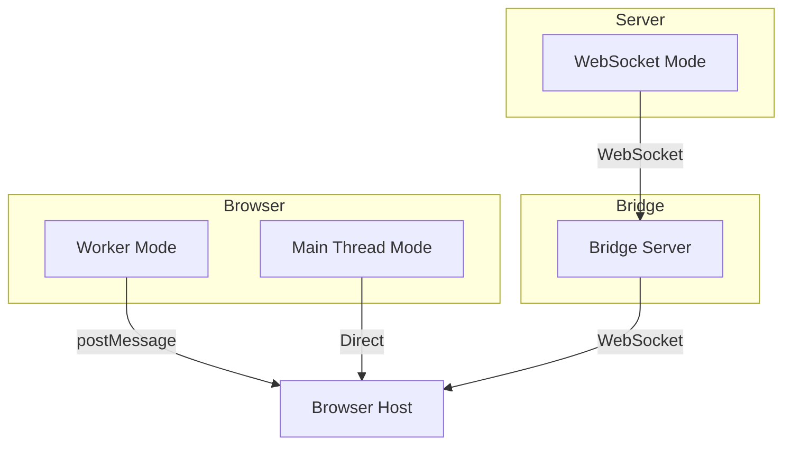
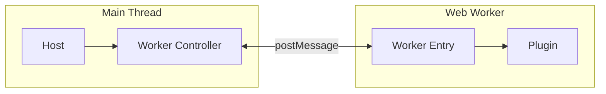
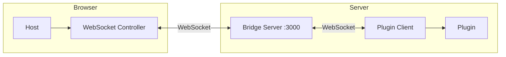
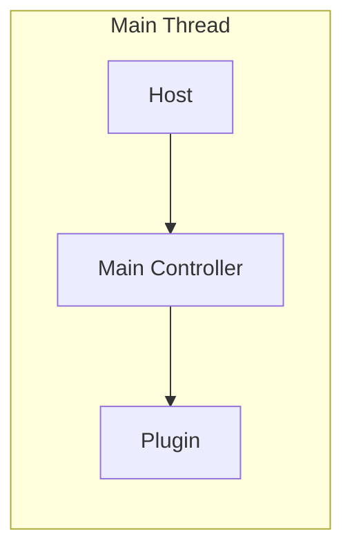
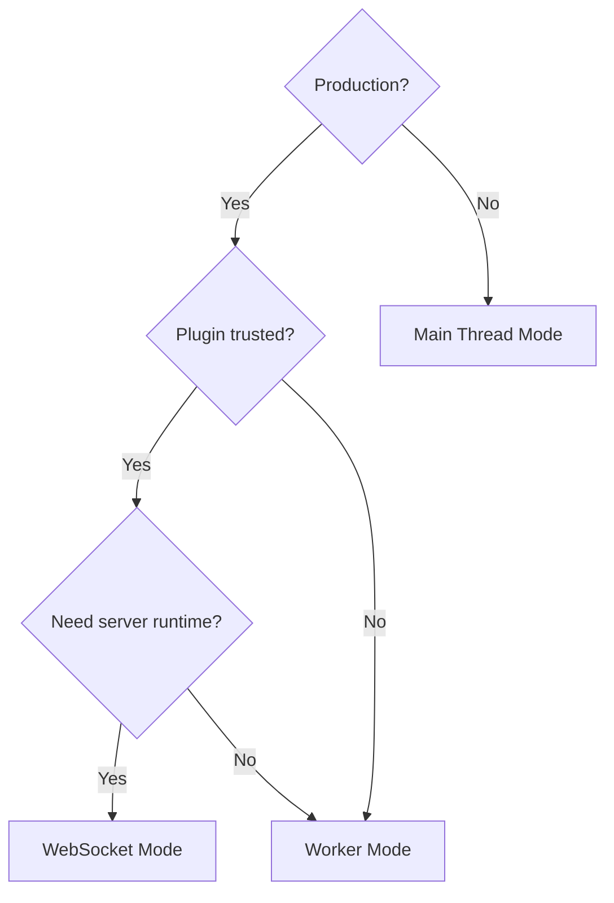

# Runtime Modes

<cite>
**Referenced Files in This Document**
- [AGENTS.md](file://AGENTS.md)
- [README.md](file://README.md)
- [packages/host-sdk/src/index.ts](file://packages/host-sdk/src/index.ts)
</cite>

## Table of Contents

1. [Overview](#overview)
2. [Worker Mode](#worker-mode)
3. [WebSocket Mode](#websocket-mode)
4. [Main Thread Mode](#main-thread-mode)
5. [Comparison](#comparison)

## Overview

Uniview supports three runtime modes for plugin execution:



**Section sources**

- [AGENTS.md](file://AGENTS.md#L184-L192)

## Worker Mode

Plugins run in Web Workers for full sandboxing:



### Usage

```typescript
// Host side
import { createWorkerController } from "@uniview/host-sdk";

const controller = createWorkerController({
  pluginUrl: "/plugins/my-plugin.js",
  initialProps: { userId: "123" },
});

await controller.connect();
```

```typescript
// Plugin side
import { startWorkerPlugin } from "@uniview/react-runtime";
import App from "./App";

startWorkerPlugin({ App });
```

### Characteristics

| Aspect          | Details                   |
| --------------- | ------------------------- |
| **Isolation**   | Full sandbox              |
| **Environment** | Browser only              |
| **DOM Access**  | None                      |
| **Security**    | High (untrusted plugins)  |
| **Performance** | Good (parallel execution) |

**Section sources**

- [AGENTS.md](file://AGENTS.md#L186-L192)
- [packages/host-sdk/src/index.ts](file://packages/host-sdk/src/index.ts#L8-L11)

## WebSocket Mode

Server-side plugins connect via Bridge Server:



### Usage

```typescript
// Host side
import { createWebSocketController } from "@uniview/host-sdk";

const controller = createWebSocketController({
  serverUrl: "ws://localhost:3000",
  pluginId: "my-plugin",
});

await controller.connect();
```

```typescript
// Plugin side
import { connectToHostServer } from "@uniview/react-runtime/ws-client";

connectToHostServer({
  App: MyPlugin,
  serverUrl: "ws://localhost:3000",
  pluginId: "my-plugin",
});
```

### Why Bridge Architecture?

| Benefit                    | Explanation                             |
| -------------------------- | --------------------------------------- |
| **Plugins as clients**     | No port management, no NAT issues       |
| **Single port**            | All plugins multiplex through port 3000 |
| **Transparent forwarding** | Bridge forwards bytes without parsing   |
| **Simplified deployment**  | Only bridge needs stable address        |

### Characteristics

| Aspect             | Details                  |
| ------------------ | ------------------------ |
| **Isolation**      | Process boundary         |
| **Environment**    | Node.js, Deno, Bun       |
| **Runtime Access** | Full (fs, network, etc.) |
| **Security**       | Medium                   |
| **Performance**    | Network dependent        |

**Section sources**

- [AGENTS.md](file://AGENTS.md#L151-L167)
- [README.md](file://README.md#L63-L88)

## Main Thread Mode

Plugins run directly in main thread (development only):



### Usage

```typescript
// Host side
import { createMainController } from "@uniview/host-sdk";
import App from "./plugin/App";

const controller = createMainController({ App });

await controller.connect();
```

### Characteristics

| Aspect          | Details                 |
| --------------- | ----------------------- |
| **Isolation**   | None                    |
| **Environment** | Browser only            |
| **DOM Access**  | Available               |
| **Security**    | None                    |
| **Performance** | Best (no serialization) |

### Use Cases

- Development and debugging
- Hot reload support
- Direct inspection in DevTools

**Section sources**

- [packages/host-sdk/src/index.ts](file://packages/host-sdk/src/index.ts#L14-L18)

## Comparison

| Mode          | Environment   | Isolation        | Security | Use Case                         |
| ------------- | ------------- | ---------------- | -------- | -------------------------------- |
| **Worker**    | Browser       | Full sandbox     | High     | Production, untrusted plugins    |
| **WebSocket** | Node/Deno/Bun | Process boundary | Medium   | Server-side, full runtime access |
| **Main**      | Browser       | None             | None     | Development, debugging           |

### Selection Guide



**Section sources**

- [AGENTS.md](file://AGENTS.md#L184-L192)
- [README.md](file://README.md#L171-L194)
