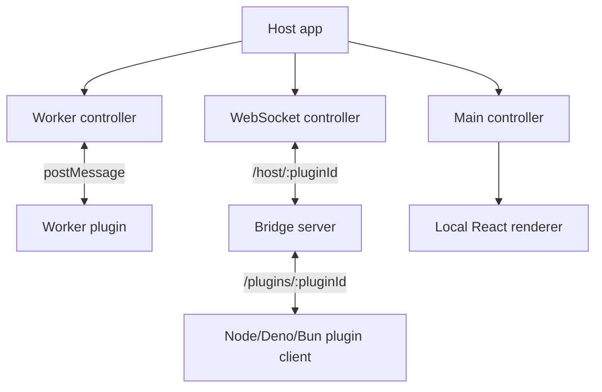

# Runtime Modes

<cite>
**Referenced Files in This Document**
- [README.md](file://README.md#L217-L260)
- [AGENTS.md](file://AGENTS.md#L187-L195)
- [packages/host-sdk/src/index.ts](file://packages/host-sdk/src/index.ts#L1-L20)
- [packages/host-sdk/src/controllers/worker.ts](file://packages/host-sdk/src/controllers/worker.ts#L19-L148)
- [packages/host-sdk/src/controllers/websocket.ts](file://packages/host-sdk/src/controllers/websocket.ts#L20-L133)
- [packages/host-sdk/src/controllers/main.ts](file://packages/host-sdk/src/controllers/main.ts#L20-L128)
- [packages/react-runtime/src/worker-entry.ts](file://packages/react-runtime/src/worker-entry.ts#L1-L24)
- [packages/react-runtime/src/ws-client-entry.ts](file://packages/react-runtime/src/ws-client-entry.ts#L1-L15)
- [examples/bridge-server/src/index.ts](file://examples/bridge-server/src/index.ts#L60-L124)
</cite>

## Table of Contents

1. [Overview](#overview)
2. [Worker Mode](#worker-mode)
3. [WebSocket Bridge Mode](#websocket-bridge-mode)
4. [Main Thread Mode](#main-thread-mode)
5. [Selection Guide](#selection-guide)

## Overview

Uniview supports three plugin execution modes: Worker, WebSocket bridge, and main-thread. Hosts consume the same `PluginController` interface regardless of mode, while runtimes choose different transport and isolation boundaries.

```mermaid
graph TB
    Host[Host app]
    Host --> Worker[Worker controller]
    Host --> WebSocket[WebSocket controller]
    Host --> Main[Main controller]
    Worker <-->|postMessage| WorkerRuntime[Worker plugin]
    WebSocket <-->|/host/:pluginId| Bridge[Bridge server]
    Bridge <-->|/plugins/:pluginId| Client[Node/Deno/Bun plugin client]
    Main --> Local[Local React renderer]
```

**Diagram sources**

- [packages/host-sdk/src/controllers/worker.ts](file://packages/host-sdk/src/controllers/worker.ts#L19-L148)
- [packages/host-sdk/src/controllers/websocket.ts](file://packages/host-sdk/src/controllers/websocket.ts#L20-L133)
- [packages/host-sdk/src/controllers/main.ts](file://packages/host-sdk/src/controllers/main.ts#L20-L128)
- [examples/bridge-server/src/index.ts](file://examples/bridge-server/src/index.ts#L60-L124)

**Section sources**

- [AGENTS.md](file://AGENTS.md#L187-L195)
- [packages/host-sdk/src/index.ts](file://packages/host-sdk/src/index.ts#L1-L20)

## Worker Mode

Worker mode fetches a browser-compatible plugin bundle, creates a module Web Worker, connects through `WorkerParentIO`/`WorkerChildIO`, and initializes the plugin with protocol version and props. It is the recommended browser sandbox mode for untrusted or isolated plugins.

**Section sources**

- [packages/host-sdk/src/controllers/worker.ts](file://packages/host-sdk/src/controllers/worker.ts#L19-L80)
- [packages/host-sdk/src/controllers/worker.ts](file://packages/host-sdk/src/controllers/worker.ts#L82-L148)
- [packages/react-runtime/src/worker-entry.ts](file://packages/react-runtime/src/worker-entry.ts#L1-L24)

## WebSocket Bridge Mode

WebSocket mode lets plugin clients run as external processes. Plugin clients connect to `/plugins/:pluginId`; hosts connect to `/host/:pluginId`; the bridge forwards messages without parsing protocol payloads. This mode is appropriate when plugins need Node/Deno/Bun runtime access.

**Section sources**

- [packages/host-sdk/src/controllers/websocket.ts](file://packages/host-sdk/src/controllers/websocket.ts#L20-L133)
- [packages/react-runtime/src/ws-client-entry.ts](file://packages/react-runtime/src/ws-client-entry.ts#L1-L15)
- [examples/bridge-server/src/index.ts](file://examples/bridge-server/src/index.ts#L60-L124)
- [README.md](file://README.md#L228-L260)

## Main Thread Mode

Main-thread mode bypasses transport and uses the React renderer locally. It is intended for development and debugging because it provides no isolation and only supports locally imported React apps in the current host SDK implementation.

**Section sources**

- [packages/host-sdk/src/controllers/main.ts](file://packages/host-sdk/src/controllers/main.ts#L20-L128)
- [AGENTS.md](file://AGENTS.md#L187-L195)

## Selection Guide

| Mode | Environment | Isolation | Best use |
| --- | --- | --- | --- |
| Worker | Browser Worker | Strong browser sandbox | Production browser plugins |
| WebSocket bridge | Node/Deno/Bun process | Process boundary | Plugins needing server/runtime access |
| Main thread | Browser main thread | None | Development and debugging |

**Section sources**

- [AGENTS.md](file://AGENTS.md#L187-L195)
- [README.md](file://README.md#L217-L260)
