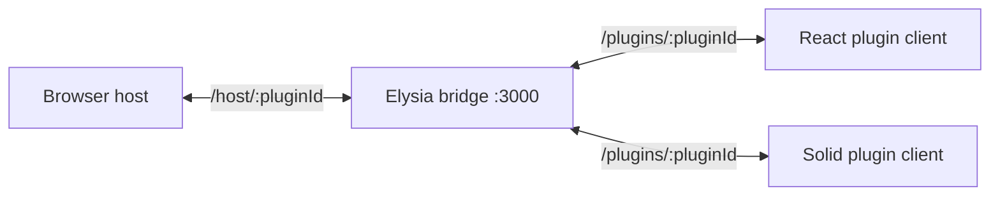

# Backend Services

<cite>
**Referenced Files in This Document**
- [examples/bridge-server/src/index.ts](file://examples/bridge-server/src/index.ts#L1-L124)
- [packages/react-runtime/src/ws-client.ts](file://packages/react-runtime/src/ws-client.ts#L22-L274)
- [packages/solid-runtime/src/ws-client.ts](file://packages/solid-runtime/src/ws-client.ts#L46-L220)
- [packages/host-sdk/src/controllers/websocket.ts](file://packages/host-sdk/src/controllers/websocket.ts#L14-L133)
- [examples/plugin-example/package.json](file://examples/plugin-example/package.json#L12-L34)
- [examples/plugin-solid-example/package.json](file://examples/plugin-solid-example/package.json#L7-L29)
</cite>

## Table of Contents

1. [Overview](#overview)
2. [Bridge Server](#bridge-server)
3. [Plugin Client Processes](#plugin-client-processes)
4. [Host WebSocket Controller](#host-websocket-controller)

## Overview

Uniview does not contain a traditional application backend or database service. Its backend-facing layer is the WebSocket bridge architecture: an Elysia bridge process multiplexes host and plugin sockets, while React and Solid plugin clients run as Node/Deno/Bun-compatible processes that connect into the bridge. This enables server-side plugin code without exposing one HTTP server per plugin.

**Diagram sources**

- [examples/bridge-server/src/index.ts](file://examples/bridge-server/src/index.ts#L60-L122)
- [packages/react-runtime/src/ws-client.ts](file://packages/react-runtime/src/ws-client.ts#L72-L90)
- [packages/host-sdk/src/controllers/websocket.ts](file://packages/host-sdk/src/controllers/websocket.ts#L52-L69)

**Section sources**

- [examples/bridge-server/src/index.ts](file://examples/bridge-server/src/index.ts#L8-L19)
- [examples/bridge-server/src/index.ts](file://examples/bridge-server/src/index.ts#L60-L124)

## Bridge Server

The bridge server keeps a map from `pluginId` to `{ pluginWs?, hostWs? }`. It serves worker bundles under `/react/:filename` and `/solid/:filename`, accepts plugin sockets at `/plugins/:pluginId`, accepts host sockets at `/host/:pluginId`, and forwards normalized newline-terminated messages between peers. The bridge intentionally does not inspect kkrpc payload semantics.

**Section sources**

- [examples/bridge-server/src/index.ts](file://examples/bridge-server/src/index.ts#L8-L19)
- [examples/bridge-server/src/index.ts](file://examples/bridge-server/src/index.ts#L21-L58)
- [examples/bridge-server/src/index.ts](file://examples/bridge-server/src/index.ts#L60-L124)

## Plugin Client Processes

React and Solid WebSocket clients expose similar options: `App`, `serverUrl`, `pluginId`, update `mode`, reconnect delay, and reconnect attempt limits. They create an RPC channel on `serverUrl/plugins/pluginId`, reset runtime state on reconnect, check `PROTOCOL_VERSION`, and send either full `updateTree` payloads or incremental `applyMutations` payloads.

**Section sources**

- [packages/react-runtime/src/ws-client.ts](file://packages/react-runtime/src/ws-client.ts#L22-L36)
- [packages/react-runtime/src/ws-client.ts](file://packages/react-runtime/src/ws-client.ts#L72-L90)
- [packages/react-runtime/src/ws-client.ts](file://packages/react-runtime/src/ws-client.ts#L111-L209)
- [packages/solid-runtime/src/ws-client.ts](file://packages/solid-runtime/src/ws-client.ts#L46-L89)
- [packages/solid-runtime/src/ws-client.ts](file://packages/solid-runtime/src/ws-client.ts#L115-L220)

## Host WebSocket Controller

The host-side controller connects to `${serverUrl}/host/${pluginId}`, exposes the host API to the plugin, initializes with the current protocol version, updates local tree state on full updates, and applies mutation batches through `MutableTree`. Its public surface is the same `PluginController` interface used by Worker and main-thread modes.

**Section sources**

- [packages/host-sdk/src/controllers/websocket.ts](file://packages/host-sdk/src/controllers/websocket.ts#L14-L75)
- [packages/host-sdk/src/controllers/websocket.ts](file://packages/host-sdk/src/controllers/websocket.ts#L77-L133)
- [examples/plugin-example/package.json](file://examples/plugin-example/package.json#L12-L34)
- [examples/plugin-solid-example/package.json](file://examples/plugin-solid-example/package.json#L7-L29)
