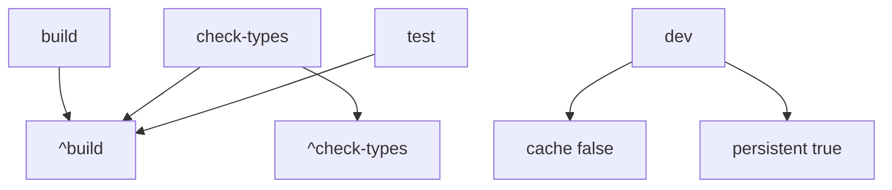

# Build and Dev Tooling

<cite>
**Referenced Files in This Document**
- [package.json](file://package.json#L4-L40)
- [pnpm-workspace.yaml](file://pnpm-workspace.yaml#L1-L9)
- [turbo.json](file://turbo.json#L1-L25)
- [examples/host-svelte-demo/package.json](file://examples/host-svelte-demo/package.json#L6-L53)
- [examples/plugin-example/build.ts](file://examples/plugin-example/build.ts#L3-L103)
- [docs/package.json](file://docs/package.json#L5-L40)
</cite>

## Table of Contents

1. [Root Scripts](#root-scripts)
2. [Turbo Tasks](#turbo-tasks)
3. [Example Orchestration](#example-orchestration)
4. [Docs Tooling](#docs-tooling)

## Root Scripts

The root package delegates package lifecycle tasks to Turbo and exposes dedicated E2E and Cypress wrappers. `pnpm build`, `pnpm dev`, `pnpm lint`, `pnpm check-types`, and `pnpm test` run matching Turbo tasks. Formatting is handled by Prettier across TypeScript, TSX, and Markdown files outside the docs app.

**Section sources**

- [package.json](file://package.json#L4-L16)
- [package.json](file://package.json#L17-L40)

## Turbo Tasks

Turbo's `build` task depends on upstream builds and declares `dist`, `.next`, and `.svelte-kit` outputs. Type checks depend on upstream builds and type checks, tests depend on upstream builds and emit coverage outputs, and dev tasks are persistent and uncached.

**Diagram sources**

- [turbo.json](file://turbo.json#L4-L24)

**Section sources**

- [turbo.json](file://turbo.json#L1-L25)
- [pnpm-workspace.yaml](file://pnpm-workspace.yaml#L1-L9)

## Example Orchestration

The Svelte demo's `dev` script runs bridge, plugin builds/clients, and the Svelte dev server in parallel. React plugin example bundles are built with Bun using separate browser worker and Bun client entry lists, which produces both Web Worker artifacts and bridge-client artifacts.

**Section sources**

- [examples/host-svelte-demo/package.json](file://examples/host-svelte-demo/package.json#L6-L20)
- [examples/plugin-example/build.ts](file://examples/plugin-example/build.ts#L3-L47)
- [examples/plugin-example/build.ts](file://examples/plugin-example/build.ts#L49-L103)

## Docs Tooling

The docs app is a separate workspace package using Next, Fumadocs, Mermaid, Tailwind, and Biome. Its formatting and linting commands are intentionally docs-local and differ from the root Prettier workflow.

**Section sources**

- [docs/package.json](file://docs/package.json#L5-L13)
- [docs/package.json](file://docs/package.json#L14-L40)
