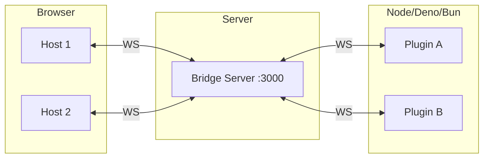

# Bridge Server

<cite>
**Referenced Files in This Document**
- [examples/bridge-server/](file://examples/bridge-server/)
- [README.md](file://README.md)
- [AGENTS.md](file://AGENTS.md)
</cite>

## Table of Contents

1. [Overview](#overview)
2. [Architecture](#architecture)
3. [How to Run](#how-to-run)
4. [Protocol](#protocol)
5. [Configuration](#configuration)

## Overview

The Bridge Server is an Elysia WebSocket multiplexer that enables server-side plugins to communicate with browser hosts. It follows a transparent forwarding pattern—bytes are forwarded without parsing.

**Key Features:**

- Single port multiplexes all connections
- Transparent byte forwarding
- No protocol parsing overhead
- Plugin ID-based routing

**Section sources**

- [examples/bridge-server/](file://examples/bridge-server/)
- [AGENTS.md](file://AGENTS.md#L151-L167)

## Architecture



### Connection Flow

1. Host connects to `ws://localhost:3000?pluginId=my-plugin`
2. Plugin connects to same URL with same `pluginId`
3. Bridge matches connections by `pluginId`
4. Bytes forwarded bidirectionally

**Section sources**

- [README.md](file://README.md#L63-L88)

## How to Run

```bash
cd examples/bridge-server
bun src/index.ts
```

Server starts on port 3000.

### With Plugin

```bash
# Terminal 1: Bridge
cd examples/bridge-server && bun src/index.ts

# Terminal 2: Plugin
cd examples/plugin-example && bun src/simple-demo.client.ts
```

### With Host

```bash
# Terminal 3: Host (or use dev:all)
cd examples/host-svelte-demo && pnpm dev
```

**Section sources**

- [examples/bridge-server/](file://examples/bridge-server/)

## Protocol

### Connection URL

```
ws://localhost:3000?pluginId=<string>&role=<host|plugin>
```

| Parameter  | Values             | Description              |
| ---------- | ------------------ | ------------------------ |
| `pluginId` | string             | Unique plugin identifier |
| `role`     | `host` \| `plugin` | Connection role          |

### Message Forwarding

```
Host → Bridge → Plugin (raw bytes)
Plugin → Bridge → Host (raw bytes)
```

The bridge does NOT parse messages—it forwards raw bytes, preserving the kkrpc protocol.

**Section sources**

- [AGENTS.md](file://AGENTS.md#L151-L167)

## Configuration

### Default Port

```typescript
const PORT = 3000;
```

### Elysia Setup

```typescript
import { Elysia } from "elysia";

const app = new Elysia()
  .ws("/ws", {
    query: t.Object({
      pluginId: t.String(),
      role: t.Union([t.Literal("host"), t.Literal("plugin")]),
    }),
    open(ws) {
      // Register connection
      const { pluginId, role } = ws.data.query;
      connections.set(pluginId, { ...connections.get(pluginId), [role]: ws });
    },
    message(ws, message) {
      // Forward to peer
      const { pluginId, role } = ws.data.query;
      const peer = getPeer(pluginId, role);
      peer?.send(message);
    },
  })
  .listen(3000);
```

**Section sources**

- [examples/bridge-server/](file://examples/bridge-server/)
