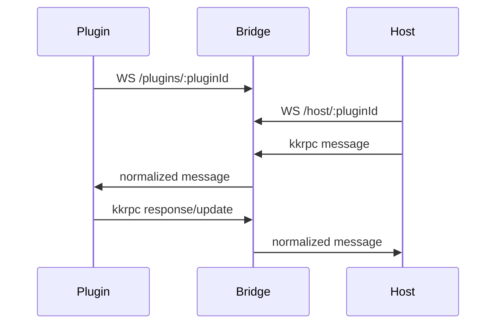

# Bridge Server

<cite>
**Referenced Files in This Document**
- [examples/bridge-server/src/bridge.ts](file://examples/bridge-server/src/bridge.ts#L1-L269)
- [examples/bridge-server/src/index.ts](file://examples/bridge-server/src/index.ts#L1-L124)
- [examples/bridge-server/src/bridge.test.ts](file://examples/bridge-server/src/bridge.test.ts#L122-L260)
- [packages/host-sdk/src/controllers/websocket.ts](file://packages/host-sdk/src/controllers/websocket.ts#L52-L133)
- [packages/react-runtime/src/ws-client.ts](file://packages/react-runtime/src/ws-client.ts#L72-L274)
- [examples/host-svelte-demo/src/routes/+page.svelte](file://examples/host-svelte-demo/src/routes/+page.svelte#L63-L72)
- [README.md](file://README.md#L228-L260)
</cite>

## Table of Contents

1. [Overview](#overview)
2. [Endpoint Model](#endpoint-model)
3. [Connection Flow](#connection-flow)
4. [Static Worker Bundle Serving](#static-worker-bundle-serving)
5. [Operational Constraints](#operational-constraints)

## Overview

The bridge server is an Elysia WebSocket multiplexer for server-side plugin mode. It pairs one plugin socket and one host socket by `pluginId`, normalizes outbound messages to newline-terminated strings, and forwards without parsing kkrpc payloads.
Built directly on Bun.serve for protocol-level ping/pong access, it includes a heartbeat mechanism that terminates unresponsive sockets and a bounded wait for late-arriving plugins.

**Section sources**

- [examples/bridge-server/src/index.ts](file://examples/bridge-server/src/index.ts#L8-L19)
- [examples/bridge-server/src/index.ts](file://examples/bridge-server/src/index.ts#L60-L124)

## Endpoint Model

The current endpoint model uses path parameters rather than query parameters:

| Endpoint | Role |
| --- | --- |
| `GET /react/:filename` | Serve React worker bundle artifacts from `examples/plugin-example/dist`. |
| `GET /solid/:filename` | Serve Solid worker bundle artifacts from `examples/plugin-solid-example/dist`. |
| `WS /plugins/:pluginId` | Plugin process connects as a client. |
| `WS /host/:pluginId` | Browser host connects after the plugin is ready. |

**Section sources**

- [examples/bridge-server/src/index.ts](file://examples/bridge-server/src/index.ts#L21-L58)
- [examples/bridge-server/src/index.ts](file://examples/bridge-server/src/index.ts#L60-L124)

## Connection Flow

```mermaid
sequenceDiagram
    participant Plugin
    participant Bridge
    participant Host
    Plugin->>Bridge: WS /plugins/:pluginId
    Host->>Bridge: WS /host/:pluginId
    Host->>Bridge: kkrpc message
    Bridge->>Plugin: normalized message
    Plugin->>Bridge: kkrpc response/update
    Bridge->>Host: normalized message
```

If a host connects before a plugin socket exists, the bridge waits up to a configurable `hostWaitMs` (default 15s) instead of rejecting instantly. Host messages are buffered (up to `maxBufferedHostMessages`, default 200) and flushed when the plugin connects. If a second host connects for the same plugin, it replaces the existing host connection.

**Diagram sources**

- [examples/bridge-server/src/index.ts](file://examples/bridge-server/src/index.ts#L60-L124)

**Section sources**

- [examples/bridge-server/src/index.ts](file://examples/bridge-server/src/index.ts#L60-L124)
- [packages/host-sdk/src/controllers/websocket.ts](file://packages/host-sdk/src/controllers/websocket.ts#L52-L75)
- [packages/react-runtime/src/ws-client.ts](file://packages/react-runtime/src/ws-client.ts#L72-L90)

## Static Worker Bundle Serving

Worker mode in browser hosts can fetch plugin bundles from the same bridge process. React bundles are served under `/react/`, Solid bundles under `/solid/`, and both responses set JavaScript content type and permissive CORS headers.

**Section sources**

- [examples/bridge-server/src/index.ts](file://examples/bridge-server/src/index.ts#L21-L58)
- [examples/host-svelte-demo/src/routes/+page.svelte](file://examples/host-svelte-demo/src/routes/+page.svelte#L63-L72)

## Heartbeat Keepalive

The bridge runs a periodic heartbeat that pings every connected socket. Sockets that miss `pong` responses within `heartbeatTimeoutMs` (default 75s) are terminated, preventing half-open TCP connections from lingering indefinitely. The heartbeat interval and timeout are configurable via `heartbeatIntervalMs` and `heartbeatTimeoutMs`.

## Operational Constraints

The bridge listens on port 3000 and should remain protocol-agnostic. Adding business logic or JSON parsing would couple it to a transport payload that is meant to stay opaque.

**Section sources**

- [examples/bridge-server/src/index.ts](file://examples/bridge-server/src/index.ts#L122-L124)
- [README.md](file://README.md#L228-L260)
