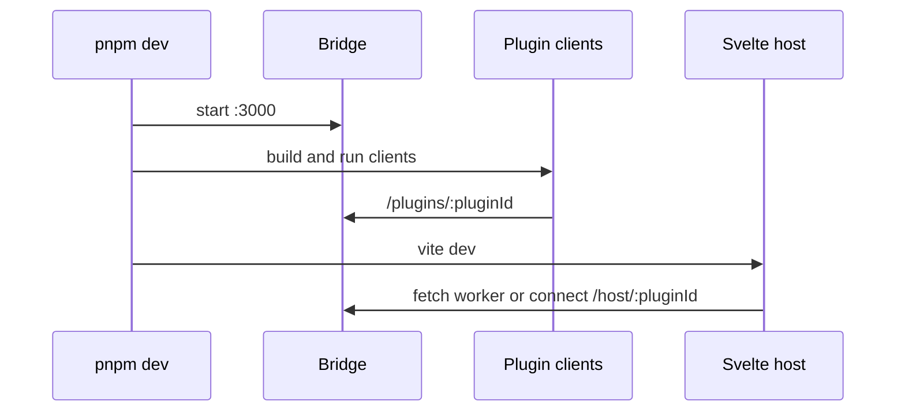

# Examples

<cite>
**Referenced Files in This Document**
- [README.md](file://README.md#L41-L134)
- [examples/host-svelte-demo/package.json](file://examples/host-svelte-demo/package.json#L6-L53)
- [examples/bridge-server/src/index.ts](file://examples/bridge-server/src/index.ts#L21-L124)
- [examples/plugin-example/build.ts](file://examples/plugin-example/build.ts#L3-L103)
- [examples/plugin-example/package.json](file://examples/plugin-example/package.json#L12-L34)
</cite>

## Table of Contents

1. [Overview](#overview)
2. [Example Categories](#example-categories)
3. [Full Demo Flow](#full-demo-flow)

## Overview

The `examples/` workspace demonstrates the complete system: host applications, bridge server, plugin API primitives, React plugins, Solid plugins, native host experiments, and terminal rendering. The Svelte demo is the primary integration target because it combines bridge, plugins, runtime switching, and full/incremental update modes.

**Section sources**

- [README.md](file://README.md#L41-L134)
- [examples/host-svelte-demo/package.json](file://examples/host-svelte-demo/package.json#L6-L53)

## Example Categories

| Category | Examples | Purpose |
| --- | --- | --- |
| Web hosts | `host-svelte-demo`, `host-react-demo`, `host-vue-demo` | Render plugin trees in Svelte, React, and Vue |
| Bridge | `bridge-server` | WebSocket multiplexer and worker bundle server |
| Plugin APIs | `plugin-api`, `plugin-solid-api` | Component primitives emitted by plugins |
| Plugins | `plugin-example`, `plugin-solid-example` | Worker and WebSocket client entry points |
| Native/TUI | macOS/AppKit/TUI examples | Alternative host/rendering experiments |

**Section sources**

- [README.md](file://README.md#L41-L134)
- [examples/plugin-example/package.json](file://examples/plugin-example/package.json#L12-L34)

## Full Demo Flow

`pnpm dev` in the Svelte demo runs bridge, plugin builds, plugin clients, and the Svelte app. Worker mode fetches bundles from the bridge HTTP endpoints, while Node server mode requires plugin clients to connect to `/plugins/:pluginId` before hosts connect to `/host/:pluginId`.

**Diagram sources**

- [examples/host-svelte-demo/package.json](file://examples/host-svelte-demo/package.json#L6-L20)
- [examples/bridge-server/src/index.ts](file://examples/bridge-server/src/index.ts#L21-L124)
- [examples/plugin-example/build.ts](file://examples/plugin-example/build.ts#L3-L103)

**Section sources**

- [examples/host-svelte-demo/package.json](file://examples/host-svelte-demo/package.json#L6-L20)
- [examples/bridge-server/src/index.ts](file://examples/bridge-server/src/index.ts#L21-L124)
