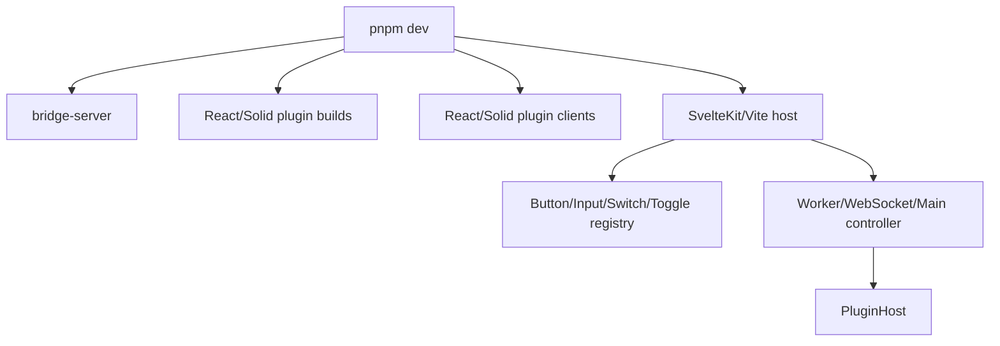

# Host Demos

<cite>
**Referenced Files in This Document**
- [examples/host-svelte-demo/src/routes/+page.svelte](file://examples/host-svelte-demo/src/routes/+page.svelte#L15-L352)
- [examples/host-svelte-demo/package.json](file://examples/host-svelte-demo/package.json#L6-L53)
- [examples/host-react-demo/src/App.tsx](file://examples/host-react-demo/src/App.tsx#L24-L120)
- [examples/host-vue-demo/src/App.vue](file://examples/host-vue-demo/src/App.vue#L19-L110)
- [packages/host-svelte/src/PluginHost.svelte](file://packages/host-svelte/src/PluginHost.svelte#L1-L51)
- [README.md](file://README.md#L41-L134)
</cite>

## Table of Contents

1. [Svelte Host Demo](#svelte-host-demo)
2. [React Host Demo](#react-host-demo)
3. [Vue Host Demo](#vue-host-demo)
4. [Native and Terminal Demos](#native-and-terminal-demos)

## Svelte Host Demo

The Svelte demo is the primary full-stack demo. It supports React and Solid plugins, simple/advanced/benchmark demos, Worker/main-thread/Node server runtime modes, full/incremental update modes, URL query synchronization, custom plugin component registration, explicit tree resync, and keyed `PluginHost` remounts when the scenario changes.

**Diagram sources**

- [examples/host-svelte-demo/package.json](file://examples/host-svelte-demo/package.json#L6-L20)
- [examples/host-svelte-demo/src/routes/+page.svelte](file://examples/host-svelte-demo/src/routes/+page.svelte#L63-L138)
- [examples/host-svelte-demo/src/routes/+page.svelte](file://examples/host-svelte-demo/src/routes/+page.svelte#L178-L309)

**Section sources**

- [examples/host-svelte-demo/package.json](file://examples/host-svelte-demo/package.json#L6-L53)
- [examples/host-svelte-demo/src/routes/+page.svelte](file://examples/host-svelte-demo/src/routes/+page.svelte#L15-L138)
- [examples/host-svelte-demo/src/routes/+page.svelte](file://examples/host-svelte-demo/src/routes/+page.svelte#L178-L352)
- [packages/host-svelte/src/PluginHost.svelte](file://packages/host-svelte/src/PluginHost.svelte#L1-L51)

## React Host Demo

The React demo shows how to implement a host adapter directly in React using the framework-agnostic host SDK. Controller lifecycle is managed with `useEffect` and `useRef`, registries are memoized, and runtime mode switches disconnect the previous controller before replacing it.

**Section sources**

- [examples/host-react-demo/src/App.tsx](file://examples/host-react-demo/src/App.tsx#L24-L76)
- [examples/host-react-demo/src/App.tsx](file://examples/host-react-demo/src/App.tsx#L94-L120)

## Vue Host Demo

The Vue demo uses Composition API state, computed controller configuration, and a watcher to disconnect old controllers. It demonstrates the same Worker/WebSocket/main-thread modes for React plugins using Vue's component and render-function ecosystem.

**Section sources**

- [examples/host-vue-demo/src/App.vue](file://examples/host-vue-demo/src/App.vue#L19-L70)
- [examples/host-vue-demo/src/App.vue](file://examples/host-vue-demo/src/App.vue#L88-L110)

## Native macOS AppKit Host

`examples/host-appkit-demo` is a native macOS AppKit host that communicates with the bridge server via WebSocket JSON messages. It features diff-based tree reconciliation via `TreeReconciler`, Raycast-style views (list, grid, form, detail, action panels), command palette search, and image resolution from plugin asset bundles. The host supports incremental mutation application through `MutableUINodeTree` and renders UINode trees using native AppKit views.

**Section sources**

- [examples/host-appkit-demo/HostAppKitDemo/App/MainViewController.swift](file://examples/host-appkit-demo/HostAppKitDemo/App/MainViewController.swift#L1-L1010)
- [examples/host-appkit-demo/HostAppKitDemo/Models/Mutation.swift](file://examples/host-appkit-demo/HostAppKitDemo/Models/Mutation.swift#L1-L75)
- [examples/host-appkit-demo/HostAppKitDemo/ViewModels/TreeReconciler.swift](file://examples/host-appkit-demo/HostAppKitDemo/ViewModels/TreeReconciler.swift)
- [examples/host-appkit-demo/HostAppKitDemo/ViewModels/MutableUINodeTree.swift](file://examples/host-appkit-demo/HostAppKitDemo/ViewModels/MutableUINodeTree.swift#L1-L228)

## Native macOS SwiftUI Host

`examples/host-macos-demo` is a simpler SwiftUI-based macOS host that demonstrates the same bridge-consumer pattern. It renders `UINode` trees through `UINodeRenderer`, uses a matching `MessageParser`/`RPCMessage`/`UINode` model set, and connects to the bridge server at a configurable URL.

**Section sources**

- [examples/host-macos-demo/HostMacOSDemo/ContentView.swift](file://examples/host-macos-demo/HostMacOSDemo/ContentView.swift)
- [examples/host-macos-demo/HostMacOSDemo/Views/UINodeRenderer.swift](file://examples/host-macos-demo/HostMacOSDemo/Views/UINodeRenderer.swift)

## Terminal Demo

The terminal UI demo renders React to a terminal target. This demonstrates host portability beyond browser and native frameworks.
