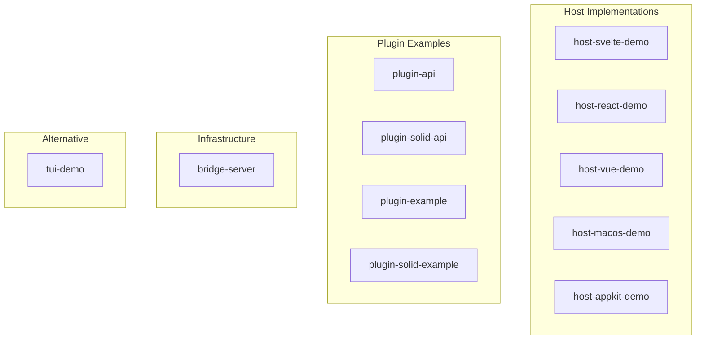

# Examples Overview

<cite>
**Referenced Files in This Document**
- [examples/](file://examples/)
- [README.md](file://README.md)
</cite>

## Table of Contents

1. [Overview](#overview)
2. [Categories](#categories)
3. [Quick Start](#quick-start)

## Overview

The `examples/` directory contains 11 demo applications demonstrating Uniview's plugin system across different frameworks, platforms, and runtime modes.

**Section sources**

- [examples/](file://examples/)
- [README.md](file://README.md#L197-L219)

## Categories



### Host Implementations

| Example                                                | Framework | Platform | Notes                      |
| ------------------------------------------------------ | --------- | -------- | -------------------------- |
| [host-svelte-demo](./Host%20Demos.md#host-svelte-demo) | Svelte 5  | Web      | Primary example, all modes |
| [host-react-demo](./Host%20Demos.md#host-react-demo)   | React 19  | Web      | React host implementation  |
| [host-vue-demo](./Host%20Demos.md#host-vue-demo)       | Vue 3     | Web      | Vue host implementation    |
| [host-macos-demo](./Host%20Demos.md#host-macos-demo)   | SwiftUI   | macOS    | Native macOS app           |
| [host-appkit-demo](./Host%20Demos.md#host-appkit-demo) | AppKit    | macOS    | Diff-based reconciliation  |

### Plugin Examples

| Example                                                             | Framework | Notes               |
| ------------------------------------------------------------------- | --------- | ------------------- |
| [plugin-api](./Plugin%20Examples.md#plugin-api)                     | React     | Reusable components |
| [plugin-solid-api](./Plugin%20Examples.md#plugin-solid-api)         | Solid     | Solid components    |
| [plugin-example](./Plugin%20Examples.md#plugin-example)             | React     | Demo plugins        |
| [plugin-solid-example](./Plugin%20Examples.md#plugin-solid-example) | Solid     | Solid demo plugins  |

### Infrastructure

| Example                               | Purpose                                       |
| ------------------------------------- | --------------------------------------------- |
| [bridge-server](./Bridge%20Server.md) | WebSocket multiplexer for server-side plugins |

### Alternative Rendering

| Example                                | Platform        |
| -------------------------------------- | --------------- |
| [tui-demo](./Host%20Demos.md#tui-demo) | Terminal (ANSI) |

**Section sources**

- [examples/](file://examples/)

## Quick Start

### Web Example (Recommended)

```bash
# Install and build
pnpm install
pnpm build

# Run complete demo
cd examples/host-svelte-demo
pnpm dev:all
```

Opens at `http://localhost:5173` with:

- Worker mode (browser sandbox)
- WebSocket mode (server-side plugins)
- Main thread mode (development)
- Benchmark mode (performance testing)

### What You'll See

1. **Plugin selection**: Choose from demo plugins
2. **Mode switching**: Toggle between Worker/WebSocket
3. **Framework switching**: React or Solid plugins
4. **Benchmark**: Compare full-tree vs incremental updates

**Section sources**

- [README.md](file://README.md#L35-L48)
