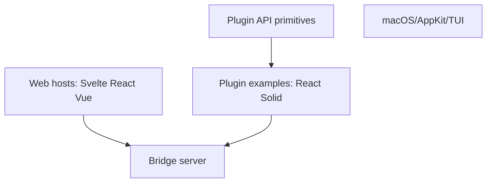

# Examples Overview

<cite>
**Referenced Files in This Document**
- [README.md](file://README.md#L41-L134)
- [examples/host-svelte-demo/package.json](file://examples/host-svelte-demo/package.json#L6-L53)
- [examples/bridge-server/src/index.ts](file://examples/bridge-server/src/index.ts#L21-L124)
- [examples/plugin-example/package.json](file://examples/plugin-example/package.json#L12-L34)
- [examples/plugin-solid-example/package.json](file://examples/plugin-solid-example/package.json#L7-L29)
</cite>

## Table of Contents

1. [Overview](#overview)
2. [Categories](#categories)
3. [Quick Start](#quick-start)

## Overview

The examples workspace demonstrates Uniview across web hosts, plugin runtimes, bridge server mode, native experiments, and terminal rendering. The Svelte host demo is the recommended first entry point because it orchestrates bridge, plugin bundles, plugin clients, and host UI in one command.

**Section sources**

- [README.md](file://README.md#L41-L134)
- [examples/host-svelte-demo/package.json](file://examples/host-svelte-demo/package.json#L6-L53)

## Categories


```mermaid
graph TB
    Hosts[Web hosts: Svelte React Vue]
    Plugins[Plugin examples: React Solid]
    APIs[Plugin API primitives]
    Bridge[Bridge server]
    Native[macOS/AppKit/TUI]
    Hosts --> Bridge
    Plugins --> Bridge
    APIs --> Plugins
```

**Diagram sources**

- [README.md](file://README.md#L41-L134)
- [examples/bridge-server/src/index.ts](file://examples/bridge-server/src/index.ts#L21-L124)

| Category | Examples | Purpose |
| --- | --- | --- |
| Hosts | Svelte, React, Vue demos | Render plugin trees in browser frameworks |
| Plugin APIs | React and Solid plugin API packages | Product primitives such as Button/Input/Switch/Toggle |
| Plugin examples | React and Solid plugin examples | Worker and bridge-client bundles |
| Infrastructure | Bridge server | WebSocket multiplexing and static bundle serving |
| Alternative hosts | macOS, AppKit, TUI | Native and terminal experiments |

**Section sources**

- [README.md](file://README.md#L41-L134)
- [examples/plugin-example/package.json](file://examples/plugin-example/package.json#L12-L34)
- [examples/plugin-solid-example/package.json](file://examples/plugin-solid-example/package.json#L7-L29)

## Quick Start

Run the complete Svelte demo after installing dependencies and building packages:

```bash
pnpm install
pnpm build
cd examples/host-svelte-demo
pnpm dev
```

The demo opens at `http://localhost:5173` and lets users switch plugin framework, runtime mode, demo type, and update mode.

**Section sources**

- [README.md](file://README.md#L41-L90)
- [examples/host-svelte-demo/package.json](file://examples/host-svelte-demo/package.json#L6-L20)
