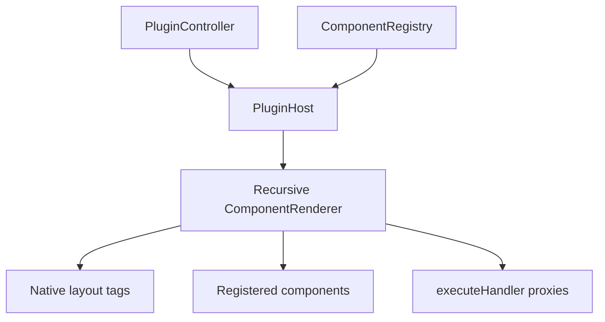

# Frontend Application

<cite>
**Referenced Files in This Document**
- [packages/host-svelte/src/PluginHost.svelte](file://packages/host-svelte/src/PluginHost.svelte#L1-L51)
- [packages/host-svelte/src/ComponentRenderer.svelte](file://packages/host-svelte/src/ComponentRenderer.svelte#L1-L246)
- [examples/host-svelte-demo/src/routes/+page.svelte](file://examples/host-svelte-demo/src/routes/+page.svelte#L15-L352)
- [examples/host-react-demo/src/App.tsx](file://examples/host-react-demo/src/App.tsx#L24-L120)
- [examples/host-vue-demo/src/App.vue](file://examples/host-vue-demo/src/App.vue#L19-L110)
- [packages/host-sdk/src/registry.ts](file://packages/host-sdk/src/registry.ts#L1-L32)
</cite>

## Table of Contents

1. [Overview](#overview)
2. [Svelte Host Adapter](#svelte-host-adapter)
3. [Demo Host Applications](#demo-host-applications)
4. [Component Registry Pattern](#component-registry-pattern)

## Overview

Frontend code in Uniview demonstrates how host frameworks render protocol trees. The reusable Svelte adapter is a package (`@uniview/host-svelte`), while React and Vue hosts live as examples that implement equivalent lifecycle, context, and recursive rendering patterns with framework-specific APIs.

**Diagram sources**

- [packages/host-svelte/src/PluginHost.svelte](file://packages/host-svelte/src/PluginHost.svelte#L8-L51)
- [packages/host-svelte/src/ComponentRenderer.svelte](file://packages/host-svelte/src/ComponentRenderer.svelte#L15-L246)
- [packages/host-sdk/src/registry.ts](file://packages/host-sdk/src/registry.ts#L8-L32)

**Section sources**

- [packages/host-svelte/src/PluginHost.svelte](file://packages/host-svelte/src/PluginHost.svelte#L8-L51)
- [packages/host-svelte/src/ComponentRenderer.svelte](file://packages/host-svelte/src/ComponentRenderer.svelte#L15-L246)

## Svelte Host Adapter

`PluginHost.svelte` accepts a `PluginController`, `ComponentRegistry`, and optional loading snippet. It sets Svelte context, subscribes to tree updates, calls `controller.connect()` on mount, disconnects on destroy, and renders an error state if plugin loading fails. `ComponentRenderer.svelte` transforms protocol props into Svelte attributes and event handlers, renders string nodes directly, maps layout tags to native elements, and dispatches custom components from the registry.

**Section sources**

- [packages/host-svelte/src/PluginHost.svelte](file://packages/host-svelte/src/PluginHost.svelte#L8-L51)
- [packages/host-svelte/src/ComponentRenderer.svelte](file://packages/host-svelte/src/ComponentRenderer.svelte#L38-L101)
- [packages/host-svelte/src/ComponentRenderer.svelte](file://packages/host-svelte/src/ComponentRenderer.svelte#L103-L246)

## Demo Host Applications

The Svelte demo is the most complete host: it supports React and Solid plugin frameworks, simple/advanced/benchmark demos, Worker/main-thread/Node server runtime modes, and full/incremental update modes. React and Vue demos focus on React plugins and show equivalent controller lifecycle management in hooks and Composition API.

**Section sources**

- [examples/host-svelte-demo/src/routes/+page.svelte](file://examples/host-svelte-demo/src/routes/+page.svelte#L15-L85)
- [examples/host-svelte-demo/src/routes/+page.svelte](file://examples/host-svelte-demo/src/routes/+page.svelte#L87-L138)
- [examples/host-svelte-demo/src/routes/+page.svelte](file://examples/host-svelte-demo/src/routes/+page.svelte#L178-L309)
- [examples/host-react-demo/src/App.tsx](file://examples/host-react-demo/src/App.tsx#L24-L76)
- [examples/host-vue-demo/src/App.vue](file://examples/host-vue-demo/src/App.vue#L19-L70)

## Component Registry Pattern

Hosts register product primitives such as `Button`, `Input`, `Switch`, and `Toggle` in a generic registry. Renderers check whether a `UINode.type` exists in the registry; layout tags are rendered natively, while registered custom primitives are passed transformed props, handler proxies, text children, and child node metadata.

**Section sources**

- [packages/host-sdk/src/registry.ts](file://packages/host-sdk/src/registry.ts#L8-L32)
- [examples/host-svelte-demo/src/routes/+page.svelte](file://examples/host-svelte-demo/src/routes/+page.svelte#L97-L123)
- [packages/host-svelte/src/ComponentRenderer.svelte](file://packages/host-svelte/src/ComponentRenderer.svelte#L212-L246)
