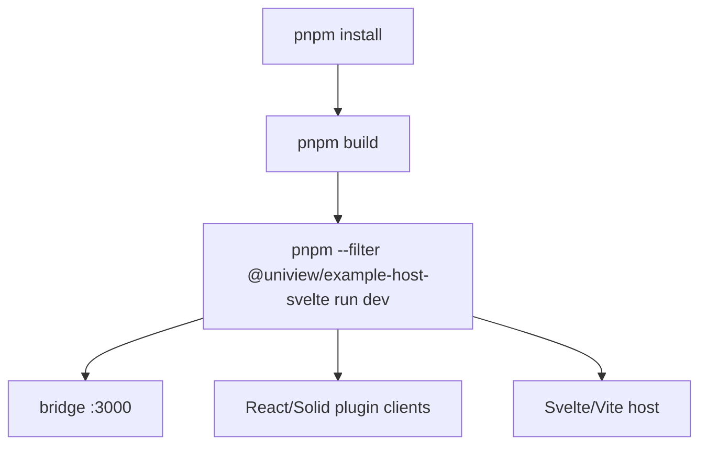

# Infrastructure

<cite>
**Referenced Files in This Document**
- [package.json](file://package.json#L4-L40)
- [pnpm-workspace.yaml](file://pnpm-workspace.yaml#L1-L9)
- [turbo.json](file://turbo.json#L1-L25)
- [scripts/e2e-fixtures.ts](file://scripts/e2e-fixtures.ts#L65-L209)
- [scripts/run-e2e.ts](file://scripts/run-e2e.ts#L19-L25)
- [scripts/run-cypress.ts](file://scripts/run-cypress.ts#L20-L41)
- [cypress.config.ts](file://cypress.config.ts#L1-L17)
- [AGENTS.md](file://AGENTS.md#L347-L355)
</cite>

## Table of Contents

1. [Overview](#overview)
2. [Local Development Infrastructure](#local-development-infrastructure)
3. [E2E Test Infrastructure](#e2e-test-infrastructure)
4. [Operational Notes](#operational-notes)

## Overview

Infrastructure in this repository is local-development and validation infrastructure rather than cloud deployment infrastructure. The root workspace coordinates package builds, example processes, documentation, and E2E fixtures. The main networked service is the bridge server on port 3000, which is started by demo scripts and E2E fixtures.

**Section sources**

- [package.json](file://package.json#L4-L40)
- [pnpm-workspace.yaml](file://pnpm-workspace.yaml#L1-L9)
- [turbo.json](file://turbo.json#L1-L25)

## Local Development Infrastructure

Root scripts run Turbo tasks for package builds, development, linting, tests, type checks, and formatting. The workspace catalog centralizes `kkrpc`, `react`, and `react-reconciler` versions. Turbo caches build outputs but disables caching for persistent dev processes.

**Diagram sources**

- [package.json](file://package.json#L4-L15)
- [scripts/e2e-fixtures.ts](file://scripts/e2e-fixtures.ts#L105-L202)

**Section sources**

- [package.json](file://package.json#L4-L15)
- [pnpm-workspace.yaml](file://pnpm-workspace.yaml#L1-L9)
- [turbo.json](file://turbo.json#L4-L24)

## E2E Test Infrastructure

E2E infrastructure builds packages, builds React and Solid plugin bundles, starts the bridge, starts plugin client processes, starts Svelte/React/Vue hosts on fixed localhost ports, waits for HTTP readiness, and tears down spawned process groups. Cypress uses `http://127.0.0.1:5173` as its default base URL and discovers specs under `cypress/e2e/**/*.cy.ts`.

**Section sources**

- [scripts/run-e2e.ts](file://scripts/run-e2e.ts#L19-L25)
- [scripts/run-cypress.ts](file://scripts/run-cypress.ts#L20-L41)
- [scripts/e2e-fixtures.ts](file://scripts/e2e-fixtures.ts#L65-L209)
- [cypress.config.ts](file://cypress.config.ts#L1-L17)

## Operational Notes

There are no repository-owned cloud resources, Terraform stacks, or deployment manifests in the current codebase. Productionizing Uniview would require adding CI workflows, bridge deployment, static plugin bundle hosting, and observability around bridge connections and plugin failures.

**Section sources**

- [package.json](file://package.json#L4-L40)
- [AGENTS.md](file://AGENTS.md#L347-L355)
