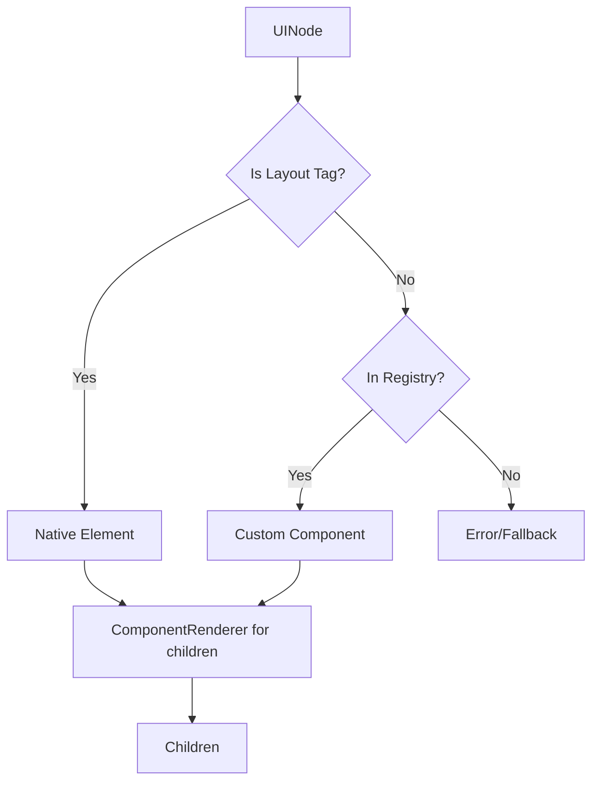

# Host Svelte

<cite>
**Referenced Files in This Document**
- [packages/host-svelte/src/index.ts](file://packages/host-svelte/src/index.ts)
- [packages/host-svelte/package.json](file://packages/host-svelte/package.json)
- [AGENTS.md](file://AGENTS.md)
</cite>

## Table of Contents

1. [Overview](#overview)
2. [Installation](#installation)
3. [Components](#components)
4. [ComponentRenderer](#componentrenderer)
5. [Usage Examples](#usage-examples)

## Overview

`@uniview/host-svelte` provides Svelte 5 adapters for rendering Uniview plugins. It uses Svelte 5 runes for reactive state management.

**Key Features:**

- Svelte 5 runes (no Svelte 4 syntax)
- Recursive component rendering
- Event handler proxying
- Loading and error states

**Section sources**

- [packages/host-svelte/package.json](file://packages/host-svelte/package.json)
- [AGENTS.md](file://AGENTS.md#L82-L87)

## Installation

```bash
pnpm add @uniview/host-svelte
```

## Components

### PluginHost

Main component for rendering plugins:

```svelte
<script lang="ts">
  import { PluginHost } from '@uniview/host-svelte';
  import { createWorkerController, createComponentRegistry } from '@uniview/host-sdk';

  const registry = createComponentRegistry<SvelteComponent>();
  const controller = createWorkerController({
    pluginUrl: '/plugins/my-plugin.js'
  });
</script>

<PluginHost {controller} {registry}>
  {#snippet loading()}
    <p>Loading plugin...</p>
  {/snippet}

  {#snippet error(message)}
    <p class="error">{message}</p>
  {/snippet}
</PluginHost>
```

### Props

| Prop         | Type                | Description              |
| ------------ | ------------------- | ------------------------ |
| `controller` | `PluginController`  | Controller from host-sdk |
| `registry`   | `ComponentRegistry` | Component type mappings  |
| `loading`    | `Snippet`           | Loading state snippet    |
| `error`      | `Snippet`           | Error state snippet      |

**Section sources**

- [packages/host-svelte/src/index.ts](file://packages/host-svelte/src/index.ts)

## ComponentRenderer

Internal component that recursively renders UINode trees:



### Layout Tag Rendering

Native HTML elements are rendered directly:

```svelte
{#if isLayoutTag(node.type)}
  <svelte:element this={node.type} {...props}>
    {#each node.children as child}
      {#if typeof child === 'string'}
        {child}
      {:else}
        <ComponentRenderer node={child} {registry} {onEvent} />
      {/if}
    {/each}
  </svelte:element>
{/if}
```

### Event Handling

Event handlers are proxied via handler IDs:

```svelte
<script>
  function createEventProps(props) {
    const eventProps = {};

    for (const [key, value] of Object.entries(props)) {
      if (isHandlerIdProp(key)) {
        const eventName = extractEventName(key);
        eventProps[`on${eventName.toLowerCase().slice(2)}`] = (e) => {
          onEvent(value, [serializeEvent(e)]);
        };
      }
    }

    return eventProps;
  }
</script>
```

**Section sources**

- [AGENTS.md](file://AGENTS.md#L99-L102)

## Usage Examples

### Complete Setup

```svelte
<script lang="ts">
  import { onMount, onDestroy } from 'svelte';
  import { PluginHost } from '@uniview/host-svelte';
  import {
    createWorkerController,
    createComponentRegistry
  } from '@uniview/host-sdk';
  import Button from './components/Button.svelte';
  import Card from './components/Card.svelte';

  const registry = createComponentRegistry<SvelteComponent>();
  registry.register('Button', Button);
  registry.register('Card', Card);

  let controller = $state(
    createWorkerController({ pluginUrl: '/plugins/app.js' })
  );

  onMount(async () => {
    await controller.connect();
  });

  onDestroy(async () => {
    await controller.disconnect();
  });
</script>

<PluginHost {controller} {registry}>
  {#snippet loading()}
    <div class="flex items-center justify-center p-8">
      <div class="animate-spin">Loading...</div>
    </div>
  {/snippet}

  {#snippet error(message)}
    <div class="text-red-500 p-4">
      Error: {message}
    </div>
  {/snippet}
</PluginHost>
```

### With Mode Switching

```svelte
<script lang="ts">
  import { PluginHost } from '@uniview/host-svelte';
  import {
    createWorkerController,
    createWebSocketController,
    createComponentRegistry
  } from '@uniview/host-sdk';

  let mode = $state<'worker' | 'websocket'>('worker');
  let controller = $state<PluginController>();

  function switchMode(newMode: 'worker' | 'websocket') {
    if (controller) {
      controller.disconnect();
    }

    controller = newMode === 'worker'
      ? createWorkerController({ pluginUrl: '/plugin.js' })
      : createWebSocketController({
          serverUrl: 'ws://localhost:3000',
          pluginId: 'app'
        });

    controller.connect();
    mode = newMode;
  }

  onMount(() => switchMode('worker'));
</script>

<div class="toolbar">
  <button onclick={() => switchMode('worker')}>Worker</button>
  <button onclick={() => switchMode('websocket')}>WebSocket</button>
</div>

{#if controller}
  <PluginHost {controller} {registry} />
{/if}
```

**Section sources**

- [AGENTS.md](file://AGENTS.md#L44-L47)
