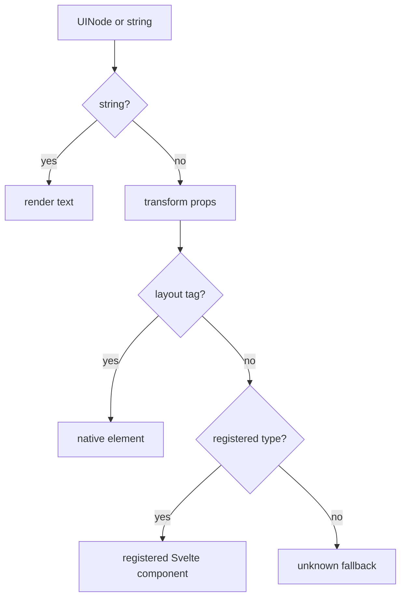

# Host Svelte

<cite>
**Referenced Files in This Document**
- [packages/host-svelte/package.json](file://packages/host-svelte/package.json#L1-L54)
- [packages/host-svelte/src/index.ts](file://packages/host-svelte/src/index.ts#L1-L2)
- [packages/host-svelte/src/PluginHost.svelte](file://packages/host-svelte/src/PluginHost.svelte#L1-L51)
- [packages/host-svelte/src/ComponentRenderer.svelte](file://packages/host-svelte/src/ComponentRenderer.svelte#L1-L249)
- [packages/host-svelte/src/event-handlers.ts](file://packages/host-svelte/src/event-handlers.ts#L1-L97)
- [examples/host-svelte-demo/src/routes/+page.svelte](file://examples/host-svelte-demo/src/routes/+page.svelte#L87-L138)
</cite>

## Table of Contents

1. [Overview](#overview)
2. [Exports](#exports)
3. [PluginHost Lifecycle](#pluginhost-lifecycle)
4. [ComponentRenderer Behavior](#componentrenderer-behavior)
5. [Svelte Demo Integration](#svelte-demo-integration)

## Overview

`@uniview/host-svelte` is the reusable Svelte 5 host adapter. Its package exports a Svelte-aware source entry through the `svelte` condition and a built default output for regular consumers.

**Section sources**

- [packages/host-svelte/package.json](file://packages/host-svelte/package.json#L1-L54)

## Exports

The public source exports are `PluginHost` and `ComponentRenderer`. Consumers normally use `PluginHost`; `ComponentRenderer` is exported for advanced or custom rendering scenarios.

**Section sources**

- [packages/host-svelte/src/index.ts](file://packages/host-svelte/src/index.ts#L1-L2)

## PluginHost Lifecycle

`PluginHost` accepts a `PluginController`, `ComponentRegistry`, and optional loading snippet. It stores controller and registry in Svelte context, subscribes to tree updates, connects on mount, captures connection errors in local state, disconnects on destroy, and renders either an error message, the current tree, a custom loading snippet, or a default loading message.

**Section sources**

- [packages/host-svelte/src/PluginHost.svelte](file://packages/host-svelte/src/PluginHost.svelte#L8-L51)

## ComponentRenderer Behavior

`ComponentRenderer` recursively renders `UINode` and text children. It transforms handler ID props into `controller.executeHandler` calls with serialized args via `serializeHandlerArgs`, maps `className`/`htmlFor`, converts style objects to CSS strings, extracts serializable values from input/change events, prevents default form submissions, handles known layout tags, recognizes void elements (`hr`, `br`, `img`, `wbr`), and passes child node metadata to registered components.

```mermaid
graph TD
    Node[UINode or string] --> Text{string?}
    Text -->|yes| RenderText[render text]
    Text -->|no| Props[transform props]
    Props --> Layout{layout tag?}
    Layout -->|yes| Native[native element]
    Layout -->|no| Registry{registered type?}
    Registry -->|yes| Custom[registered Svelte component]
    Registry -->|no| Unknown[unknown fallback]
```

**Diagram sources**

- [packages/host-svelte/src/ComponentRenderer.svelte](file://packages/host-svelte/src/ComponentRenderer.svelte#L38-L246)

**Section sources**

- [packages/host-svelte/src/ComponentRenderer.svelte](file://packages/host-svelte/src/ComponentRenderer.svelte#L15-L103)
- [packages/host-svelte/src/ComponentRenderer.svelte](file://packages/host-svelte/src/ComponentRenderer.svelte#L105-L171)
- [packages/host-svelte/src/ComponentRenderer.svelte](file://packages/host-svelte/src/ComponentRenderer.svelte#L174-L249)
- [packages/host-svelte/src/event-handlers.ts](file://packages/host-svelte/src/event-handlers.ts#L1-L97)

## Svelte Demo Integration

The main Svelte demo creates a registry for `Button`, `Input`, `Switch`, and `Toggle`, selects a controller based on runtime mode, disconnects old controllers during reactive cleanup, and renders `PluginHost` keyed by framework/runtime/demo/update mode.

**Section sources**

- [examples/host-svelte-demo/src/routes/+page.svelte](file://examples/host-svelte-demo/src/routes/+page.svelte#L87-L138)
- [examples/host-svelte-demo/src/routes/+page.svelte](file://examples/host-svelte-demo/src/routes/+page.svelte#L292-L309)
