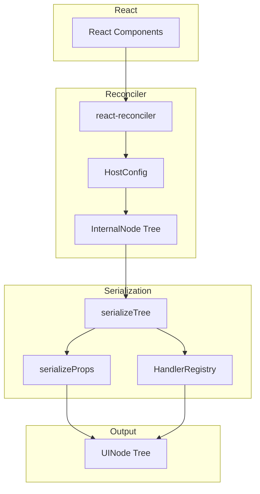

# React Renderer

<cite>
**Referenced Files in This Document**
- [packages/react-renderer/src/index.ts](file://packages/react-renderer/src/index.ts)
- [packages/react-renderer/src/reconciler/renderer.ts](file://packages/react-renderer/src/reconciler/renderer.ts)
- [packages/react-renderer/src/serialization/serialize.ts](file://packages/react-renderer/src/serialization/serialize.ts)
- [packages/react-renderer/src/serialization/handler-registry.ts](file://packages/react-renderer/src/serialization/handler-registry.ts)
- [packages/react-renderer/package.json](file://packages/react-renderer/package.json)
</cite>

## Table of Contents

1. [Overview](#overview)
2. [Installation](#installation)
3. [API Reference](#api-reference)
4. [Internal Architecture](#internal-architecture)
5. [Handler Registry](#handler-registry)
6. [Usage Examples](#usage-examples)

## Overview

`@uniview/react-renderer` provides a custom React reconciler that produces serializable `InternalNode` trees instead of DOM. This enables React components to run in Web Workers, Node.js, Deno, or Bun without DOM dependencies.

**Key Features:**

- No DOM dependencies
- Works in any JavaScript environment
- Serializable output for RPC transmission
- Handler registry for event serialization

**Section sources**

- [packages/react-renderer/src/index.ts](file://packages/react-renderer/src/index.ts)
- [packages/react-renderer/package.json](file://packages/react-renderer/package.json)

## Installation

```bash
pnpm add @uniview/react-renderer
```

## API Reference

### Exports

```typescript
// Renderer API
export {
  createRenderer,
  render,
  createRenderBridge,
  type RenderBridge,
} from "./reconciler/renderer";

// Types
export type { InternalNode, TextNode } from "./reconciler/types";

// Serialization
export { HandlerRegistry } from "./serialization/handler-registry";
export { serializeTree } from "./serialization/serialize";
export { serializeProps } from "./serialization/serialize-props";

// Mutations
export { MutationCollector } from "./mutation/mutation-collector";
```

### createRenderer / render

```typescript
import { createRenderer, render, createRenderBridge } from '@uniview/react-renderer';

// Create a bridge to receive tree updates
const bridge = createRenderBridge();

// Subscribe to updates
const unsubscribe = bridge.subscribe((root) => {
  console.log('Tree updated:', root);
});

// Render a React element
render(<App />, bridge);

// Cleanup
unsubscribe();
```

### RenderBridge

```typescript
interface RenderBridge {
  subscribe(callback: (root: InternalNode | null) => void): () => void;
  update(root: InternalNode | null): void;
}
```

### serializeTree

Convert internal nodes to protocol-compliant UINode:

```typescript
import { serializeTree, HandlerRegistry } from "@uniview/react-renderer";

const registry = new HandlerRegistry();
const bridge = createRenderBridge();

bridge.subscribe((root) => {
  if (root) {
    const uiNode = serializeTree(root, registry);
    // uiNode is now JSON-serializable
  }
});
```

**Section sources**

- [packages/react-renderer/src/reconciler/renderer.ts](file://packages/react-renderer/src/reconciler/renderer.ts)
- [packages/react-renderer/src/serialization/serialize.ts](file://packages/react-renderer/src/serialization/serialize.ts)

## Internal Architecture



### InternalNode Type

```typescript
interface InternalNode {
  id: string;
  type: string;
  props: Record<string, unknown>;
  children: (InternalNode | TextNode)[];
  parent: InternalNode | null;
}

interface TextNode {
  id: string;
  text: string;
  _isTextNode: true;
}
```

**Section sources**

- [packages/react-renderer/src/reconciler/types.ts](file://packages/react-renderer/src/reconciler/types.ts)

## Handler Registry

Functions cannot cross RPC boundaries. The handler registry maps functions to string IDs:

```typescript
import { HandlerRegistry } from "@uniview/react-renderer";

const registry = new HandlerRegistry();

// Register a handler
const handlerId = registry.register(() => console.log("clicked"));
// Returns: "handler_0"

// Execute by ID
await registry.execute(handlerId, []);

// Clear all handlers
registry.clear();
```

### Handler ID Format

```
handler_<counter>
```

Example: `handler_0`, `handler_1`, `handler_42`

**Section sources**

- [packages/react-renderer/src/serialization/handler-registry.ts](file://packages/react-renderer/src/serialization/handler-registry.ts)

## Usage Examples

### Basic Usage

```typescript
import { createRenderBridge, render, serializeTree, HandlerRegistry } from '@uniview/react-renderer';

function createPluginRuntime(App: React.ComponentType) {
  const bridge = createRenderBridge();
  const registry = new HandlerRegistry();

  bridge.subscribe((root) => {
    const tree = root ? serializeTree(root, registry) : null;
    // Send tree to host via RPC
    rpc.call('updateTree', tree);
  });

  render(<App />, bridge);

  return {
    executeHandler: (id: string, args: unknown[]) => registry.execute(id, args),
    destroy: () => registry.clear()
  };
}
```

### With Event Handlers

```tsx
// React component
function Counter() {
  const [count, setCount] = useState(0);

  return (
    <div>
      <p>Count: {count}</p>
      <button onClick={() => setCount((c) => c + 1)}>Increment</button>
    </div>
  );
}

// The onClick handler becomes:
// props: { "_onClickHandlerId": "handler_0" }
// Host calls: executeHandler("handler_0", [])
```

**Section sources**

- [packages/react-renderer/src/serialization/serialize.ts](file://packages/react-renderer/src/serialization/serialize.ts)
