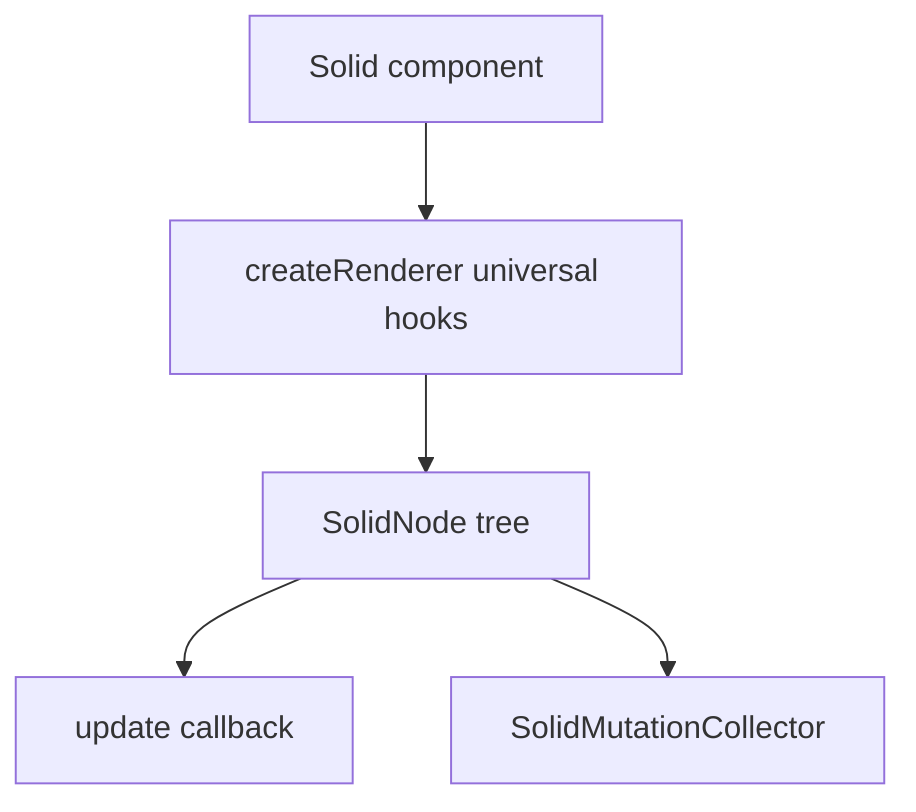

# Solid Renderer

<cite>
**Referenced Files in This Document**
- [packages/solid-renderer/package.json](file://packages/solid-renderer/package.json#L1-L39)
- [packages/solid-renderer/src/index.ts](file://packages/solid-renderer/src/index.ts#L1-L56)
- [packages/solid-renderer/src/renderer/reconciler.ts](file://packages/solid-renderer/src/renderer/reconciler.ts#L1-L181)
- [packages/solid-renderer/src/serialization/serialize.ts](file://packages/solid-renderer/src/serialization/serialize.ts#L18-L52)
- [packages/solid-renderer/src/serialization/serialize-props.ts](file://packages/solid-renderer/src/serialization/serialize-props.ts#L11-L51)
- [packages/solid-renderer/src/mutation/mutation-collector.ts](file://packages/solid-renderer/src/mutation/mutation-collector.ts#L34-L218)
- [examples/plugin-solid-example/build.ts](file://examples/plugin-solid-example/build.ts#L1-L115)
</cite>

## Table of Contents

1. [Overview](#overview)
2. [Public API](#public-api)
3. [Universal Renderer](#universal-renderer)
4. [Serialization](#serialization)
5. [Build Requirements](#build-requirements)

## Overview

`@uniview/solid-renderer` provides a Solid universal renderer that produces the same protocol-compatible tree shape used by React plugins. It is DOM-free and designed for Worker and server-side plugin execution.

**Section sources**

- [packages/solid-renderer/package.json](file://packages/solid-renderer/package.json#L1-L39)
- [packages/solid-renderer/src/index.ts](file://packages/solid-renderer/src/index.ts#L1-L56)

## Public API

The package exports Solid renderer primitives, Solid node types, serialization helpers, `HandlerRegistry`, `SolidMutationCollector`, and selected re-exports from `solid-js` such as `For`, `Show`, `createSignal`, and `createEffect`.

**Section sources**

- [packages/solid-renderer/src/index.ts](file://packages/solid-renderer/src/index.ts#L1-L56)

## Universal Renderer

The reconciler keeps module-level root and callback state, schedules updates on microtasks, creates element/text/slot nodes, collects mutations when a collector is active, and delegates Solid's platform hooks to a copied universal renderer implementation.

**Diagram sources**

- [packages/solid-renderer/src/renderer/reconciler.ts](file://packages/solid-renderer/src/renderer/reconciler.ts#L7-L53)
- [packages/solid-renderer/src/renderer/reconciler.ts](file://packages/solid-renderer/src/renderer/reconciler.ts#L55-L181)

**Section sources**

- [packages/solid-renderer/src/renderer/reconciler.ts](file://packages/solid-renderer/src/renderer/reconciler.ts#L1-L181)

## Serialization

Solid serialization converts element and text nodes to `UINode` and string children, skips slot nodes, and serializes event props using the protocol event helper set. Unlike React's regex-based handler detection, Solid serialization follows protocol `EVENT_PROPS`.

**Section sources**

- [packages/solid-renderer/src/serialization/serialize.ts](file://packages/solid-renderer/src/serialization/serialize.ts#L18-L52)
- [packages/solid-renderer/src/serialization/serialize-props.ts](file://packages/solid-renderer/src/serialization/serialize-props.ts#L11-L51)
- [packages/solid-renderer/src/mutation/mutation-collector.ts](file://packages/solid-renderer/src/mutation/mutation-collector.ts#L34-L218)

## Build Requirements

Solid plugin examples compile with Babel and `babel-preset-solid` configured for `moduleName: "@uniview/solid-renderer"` and `generate: "universal"`. This transform is required because DOM-oriented Solid JSX output would not run in Worker or server-side plugin runtimes.

**Section sources**

- [examples/plugin-solid-example/build.ts](file://examples/plugin-solid-example/build.ts#L1-L31)
- [examples/plugin-solid-example/build.ts](file://examples/plugin-solid-example/build.ts#L34-L115)
