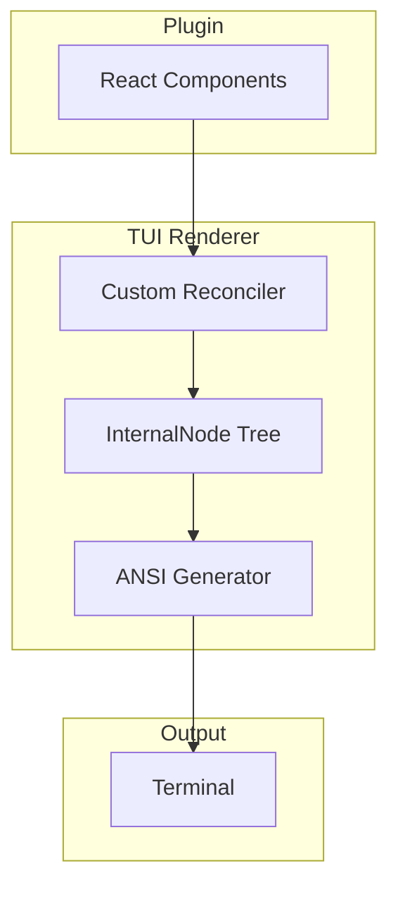

# TUI Renderer

<cite>
**Referenced Files in This Document**
- [packages/tui-renderer/package.json](file://packages/tui-renderer/package.json)
- [examples/tui-demo/](file://examples/tui-demo/)
- [README.md](file://README.md)
</cite>

## Table of Contents

1. [Overview](#overview)
2. [Installation](#installation)
3. [Architecture](#architecture)
4. [Usage](#usage)
5. [Limitations](#limitations)

## Overview

`@uniview/tui-renderer` provides a Terminal UI renderer for Uniview plugins. Similar to React Native, it renders React components to terminal output using ANSI escape codes instead of DOM.

**Key Features:**

- No browser required
- ANSI escape codes for terminal output
- Standalone renderer (independent of web/native)
- Same React plugin code works in terminal

**Section sources**

- [packages/tui-renderer/package.json](file://packages/tui-renderer/package.json)
- [README.md](file://README.md#L171-L172)

## Installation

```bash
pnpm add @uniview/tui-renderer
```

## Architecture



### Key Dependencies

| Package            | Purpose                        |
| ------------------ | ------------------------------ |
| `react-reconciler` | Custom React renderer          |
| `ansi-escapes`     | ANSI escape code generation    |
| `string-width`     | Calculate string display width |

**Section sources**

- [packages/tui-renderer/package.json](file://packages/tui-renderer/package.json)

## Usage

### Basic Example

```typescript
// tui-app.ts
import { render } from "@uniview/tui-renderer";
import { useState } from "react";

function App() {
  const [count, setCount] = useState(0);

  return (
    <box>
      <text>Count: {count}</text>
      <button onClick={() => setCount(c => c + 1)}>
        Increment
      </button>
    </box>
  );
}

// Render to terminal
render(<App />);
```

### Running

```bash
cd examples/tui-demo
pnpm dev
```

### Supported Elements

| Element  | Description       |
| -------- | ----------------- |
| `box`    | Container element |
| `text`   | Text content      |
| `button` | Clickable button  |

**Section sources**

- [examples/tui-demo/](file://examples/tui-demo/)

## Limitations

### No Mouse Support

Terminal UI typically uses keyboard navigation. Mouse events require terminal emulators that support mouse protocols.

### Limited Styling

ANSI styling supports:

- Foreground colors
- Background colors
- Bold, italic, underline
- No complex layouts (flexbox, grid)

### Single Window

Unlike web apps, terminal UIs are single-screen. No tabs, modals, or multi-window support.

### Input Handling

Keyboard input requires raw mode:

```typescript
import { stdin as input, stdout as output } from "process";

input.setRawMode(true);
input.resume();
input.setEncoding("utf8");
```

**Section sources**

- [packages/tui-renderer/package.json](file://packages/tui-renderer/package.json)
