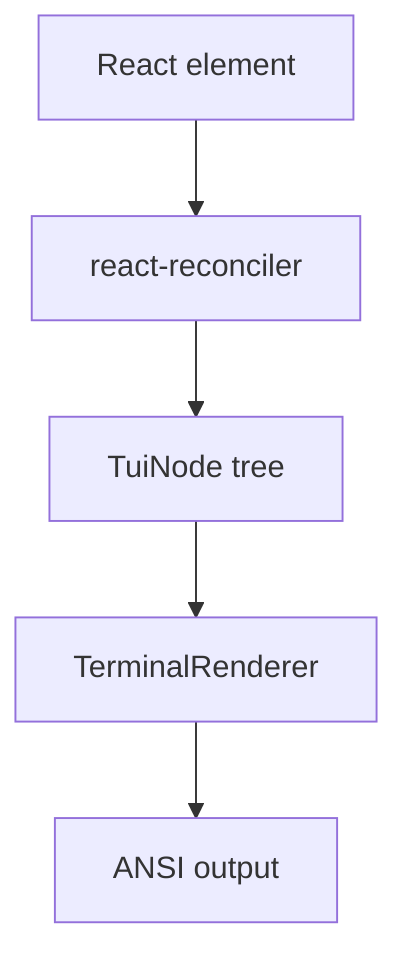

# TUI Renderer

<cite>
**Referenced Files in This Document**
- [packages/tui-renderer/package.json](file://packages/tui-renderer/package.json#L1-L46)
- [packages/tui-renderer/src/index.ts](file://packages/tui-renderer/src/index.ts#L1-L11)
- [packages/tui-renderer/src/components.tsx](file://packages/tui-renderer/src/components.tsx#L1-L80)
- [packages/tui-renderer/src/reconciler/renderer.ts](file://packages/tui-renderer/src/reconciler/renderer.ts#L1-L51)
- [packages/tui-renderer/src/terminal/renderer.ts](file://packages/tui-renderer/src/terminal/renderer.ts#L1-L135)
- [README.md](file://README.md#L92-L99)
</cite>

## Table of Contents

1. [Overview](#overview)
2. [Public API](#public-api)
3. [Rendering Architecture](#rendering-architecture)
4. [Primitive Components](#primitive-components)
5. [Usage](#usage)

## Overview

`@uniview/tui-renderer` is a standalone React reconciler that renders to terminal output instead of DOM or protocol host adapters. It is useful as a non-DOM rendering experiment and reference for native-like targets.

**Section sources**

- [packages/tui-renderer/package.json](file://packages/tui-renderer/package.json#L1-L46)
- [README.md](file://README.md#L92-L99)

## Public API

The package exports `createTuiRoot`, root option/types, and React component primitives `Box`, `Text`, `Button`, `Input`, and `Newline`.

**Section sources**

- [packages/tui-renderer/src/index.ts](file://packages/tui-renderer/src/index.ts#L1-L11)

## Rendering Architecture

`createTuiRoot()` creates a terminal renderer, a React reconciler container, and a root object with `render()` and `destroy()`. The terminal renderer measures text width, computes simple row/column layouts, tracks focusable controls, and emits ANSI-styled output.

```mermaid
graph TD
    React[React element] --> Reconciler[react-reconciler]
    Reconciler --> Tree[TuiNode tree]
    Tree --> Terminal[TerminalRenderer]
    Terminal --> ANSI[ANSI output]
```

**Diagram sources**

- [packages/tui-renderer/src/reconciler/renderer.ts](file://packages/tui-renderer/src/reconciler/renderer.ts#L1-L51)
- [packages/tui-renderer/src/terminal/renderer.ts](file://packages/tui-renderer/src/terminal/renderer.ts#L1-L135)

**Section sources**

- [packages/tui-renderer/src/reconciler/renderer.ts](file://packages/tui-renderer/src/reconciler/renderer.ts#L1-L51)
- [packages/tui-renderer/src/terminal/renderer.ts](file://packages/tui-renderer/src/terminal/renderer.ts#L1-L135)

## Primitive Components

The primitive set is small: `Box` controls simple layout and styles, `Text` displays styled text, `Button` supports `onPress`, `Input` supports `value`, `placeholder`, width, and `onChange`, and `Newline` inserts line breaks. These are React component wrappers over custom reconciler element names.

**Section sources**

- [packages/tui-renderer/src/components.tsx](file://packages/tui-renderer/src/components.tsx#L1-L80)

## Usage

The README documents a terminal UI example under `examples/tui-demo`. Unlike the browser plugin path, this renderer does not use `@uniview/protocol` or the bridge; it renders React directly to the terminal.

**Section sources**

- [README.md](file://README.md#L92-L99)
- [packages/tui-renderer/src/index.ts](file://packages/tui-renderer/src/index.ts#L1-L11)
