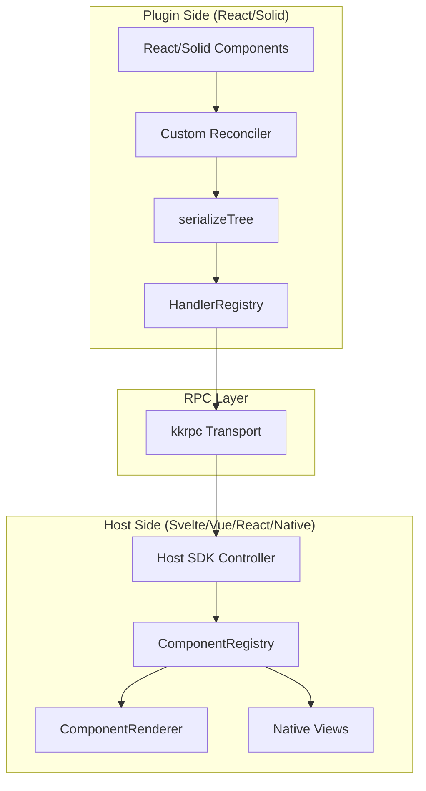
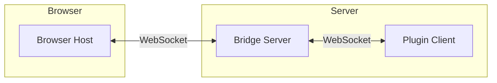

# System Overview

<cite>
**Referenced Files in This Document**
- [AGENTS.md](file://AGENTS.md)
- [README.md](file://README.md)
- [package.json](file://package.json)
- [pnpm-workspace.yaml](file://pnpm-workspace.yaml)
- [turbo.json](file://turbo.json)
</cite>

## Table of Contents

1. [Introduction](#introduction)
2. [Architecture](#architecture)
3. [Key Features](#key-features)
4. [Technology Stack](#technology-stack)
5. [Package Overview](#package-overview)
6. [Use Cases](#use-cases)

## Introduction

Uniview is a universal plugin system that enables writing UI plugins in React or Solid that can be rendered by any host framework (Svelte, Vue, React, or native platforms). Plugins run in isolated environments—Web Workers, Node.js, Deno, or Bun—and communicate with hosts via type-safe RPC using the kkrpc library.

The core innovation is the **UINode tree**: a serializable representation of UI that can be transmitted over any transport. Plugins produce UINode trees using custom reconcilers (for React or Solid), and hosts render these trees using framework-specific adapters.

**Section sources**

- [AGENTS.md](file://AGENTS.md#L7-L10)
- [README.md](file://README.md#L3-L8)

## Architecture



### Bridge Architecture

For server-side plugins, Uniview uses a Bridge Server pattern:



**Why Bridge Architecture?**

1. **Plugins as Clients**: Plugins connect TO the bridge server—no port/NAT issues
2. **Single Port**: All plugins multiplex through port 3000
3. **Transparent Forwarding**: Bridge forwards bytes without parsing, preserving kkrpc protocol
4. **Simplified Deployment**: Only bridge needs a stable address

**Diagram sources**

- [AGENTS.md](file://AGENTS.md#L155-L167)
- [README.md](file://README.md#L63-L88)

## Key Features

| Feature                 | Description                                      |
| ----------------------- | ------------------------------------------------ |
| **Framework Agnostic**  | Write plugins in React or Solid, render anywhere |
| **Sandboxed Execution** | Plugins run in Web Workers for security          |
| **Server-Side Plugins** | Node.js/Deno/Bun via WebSocket Bridge            |
| **Incremental Updates** | Only changed nodes sent over RPC                 |
| **Type-Safe RPC**       | Full TypeScript support via kkrpc                |
| **Multiple Hosts**      | Svelte, Vue, React, native macOS, terminal       |

**Section sources**

- [README.md](file://README.md#L10-L21)
- [AGENTS.md](file://AGENTS.md#L186-L192)

## Technology Stack

| Layer                | Technology                        |
| -------------------- | --------------------------------- |
| **Plugin Framework** | React 19, Solid.js                |
| **RPC Protocol**     | kkrpc ^0.6.7                      |
| **Validation**       | Zod                               |
| **Host Framework**   | Svelte 5 (runes), Vue 3, React 19 |
| **Build System**     | pnpm workspaces, turbo            |
| **Bundler**          | tsdown                            |
| **Runtime**          | Web Workers, Node.js, Deno, Bun   |

**Section sources**

- [pnpm-workspace.yaml](file://pnpm-workspace.yaml#L7-L10)
- [package.json](file://package.json#L11-L18)

## Package Overview

| Package                                                   | Purpose                                   |
| --------------------------------------------------------- | ----------------------------------------- |
| [@uniview/protocol](./Packages/Protocol.md)               | Core types, UINode schema, RPC interfaces |
| [@uniview/react-renderer](./Packages/React%20Renderer.md) | Custom React reconciler                   |
| [@uniview/solid-renderer](./Packages/Solid%20Renderer.md) | Solid universal renderer                  |
| [@uniview/react-runtime](./Packages/React%20Runtime.md)   | React plugin bootstrap                    |
| [@uniview/solid-runtime](./Packages/Solid%20Runtime.md)   | Solid plugin bootstrap                    |
| [@uniview/host-sdk](./Packages/Host%20SDK.md)             | Framework-agnostic host controller        |
| [@uniview/host-svelte](./Packages/Host%20Svelte.md)       | Svelte 5 rendering adapter                |
| [@uniview/tui-renderer](./Packages/TUI%20Renderer.md)     | Terminal UI renderer                      |

**Section sources**

- [AGENTS.md](file://AGENTS.md#L12-L36)
- [README.md](file://README.md#L23-L33)

## Use Cases

### Web Application with Sandboxed Plugins

```
Browser Host (Svelte) ←→ Web Worker Plugin (React)
```

Use for: Production apps requiring security isolation, untrusted plugin execution.

### Server-Side Plugin System

```
Browser Host (Vue) ←→ Bridge Server ←→ Node.js Plugin (React)
```

Use for: Full runtime access, file system operations, database connections.

### Native Application Integration

```
macOS App (SwiftUI) ←→ Bridge Server ←→ Bun Plugin (React)
```

Use for: Cross-platform native apps sharing plugin code.

### Terminal UI

```
Terminal ←→ TUI Renderer (React Native-style)
```

Use for: CLI tools, development utilities, server dashboards.

**Section sources**

- [AGENTS.md](file://AGENTS.md#L319-L335)
- [README.md](file://README.md#L173-L194)
