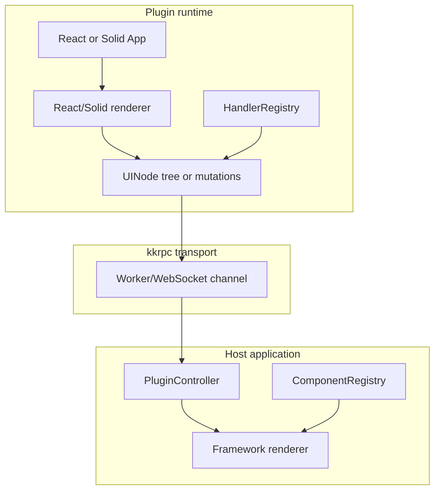

# System Overview

<cite>
**Referenced Files in This Document**
- [README.md](file://README.md#L1-L40)
- [README.md](file://README.md#L217-L260)
- [AGENTS.md](file://AGENTS.md#L7-L64)
- [AGENTS.md](file://AGENTS.md#L187-L195)
- [package.json](file://package.json#L4-L40)
- [pnpm-workspace.yaml](file://pnpm-workspace.yaml#L1-L9)
- [turbo.json](file://turbo.json#L1-L25)
- [packages/protocol/src/tree.ts](file://packages/protocol/src/tree.ts#L104-L129)
- [packages/protocol/src/rpc.ts](file://packages/protocol/src/rpc.ts#L9-L81)
</cite>

## Table of Contents

1. [Introduction](#introduction)
2. [System Architecture](#system-architecture)
3. [Runtime Modes](#runtime-modes)
4. [Package Overview](#package-overview)
5. [Repository Navigation](#repository-navigation)

## Introduction

Uniview is a universal plugin system for React and Solid plugins that can render in host frameworks such as Svelte, React, Vue, and native/terminal experiments. Plugins execute in isolated or separated runtimes and communicate with hosts through kkrpc using protocol-defined `UINode` trees, event handler IDs, and update methods.

**Section sources**

- [README.md](file://README.md#L1-L27)
- [AGENTS.md](file://AGENTS.md#L7-L10)
- [packages/protocol/src/tree.ts](file://packages/protocol/src/tree.ts#L104-L129)

## System Architecture

```mermaid
graph TB
    subgraph Plugin[Plugin runtime]
        App[React or Solid App]
        Renderer[React/Solid renderer]
        Registry[HandlerRegistry]
        Tree[UINode tree or mutations]
    end
    subgraph Transport[kkrpc transport]
        RPC[Worker/WebSocket channel]
    end
    subgraph Host[Host application]
        Controller[PluginController]
        Components[ComponentRegistry]
        Adapter[Framework renderer]
    end
    App --> Renderer --> Tree
    Registry --> Tree
    Tree --> RPC --> Controller --> Adapter
    Components --> Adapter
```

**Diagram sources**

- [README.md](file://README.md#L6-L27)
- [packages/protocol/src/rpc.ts](file://packages/protocol/src/rpc.ts#L9-L81)
- [AGENTS.md](file://AGENTS.md#L41-L64)

**Section sources**

- [README.md](file://README.md#L217-L260)
- [AGENTS.md](file://AGENTS.md#L336-L345)

## Runtime Modes

Uniview supports Worker mode for browser sandboxing, WebSocket bridge mode for Node/Deno/Bun plugin processes, and main-thread mode for development/debugging. The public host controller API stays consistent across these modes.

**Section sources**

- [AGENTS.md](file://AGENTS.md#L187-L195)
- [README.md](file://README.md#L217-L260)

## Package Overview

| Package | Role |
| --- | --- |
| `@uniview/protocol` | Serializable trees, RPC interfaces, events, mutations, validators |
| `@uniview/react-renderer` | React reconciler to internal tree and `UINode` serialization |
| `@uniview/solid-renderer` | Solid universal renderer to `UINode` serialization |
| `@uniview/react-runtime` | React Worker and bridge-client plugin bootstrap |
| `@uniview/solid-runtime` | Solid Worker and bridge-client plugin bootstrap |
| `@uniview/host-sdk` | Framework-agnostic controller and registry |
| `@uniview/host-svelte` | Svelte 5 host adapter |
| `@uniview/tui-renderer` | Standalone React-to-terminal renderer |

**Section sources**

- [README.md](file://README.md#L28-L40)
- [AGENTS.md](file://AGENTS.md#L11-L39)

## Repository Navigation

Start with [Getting Started Guide](./Getting%20Started%20Guide.md), then use [Architecture](./Architecture/Architecture.md), [Technology Stack & Architecture](./Technology%20Stack%20%26%20Architecture.md), [API Reference](./API%20Reference.md), [Packages](./Packages/Packages.md), [Examples](./Examples/Examples.md), and [Development Guidelines](./Development%20Guidelines.md) depending on whether you need onboarding, design context, public API details, package internals, demo behavior, or contribution practices.

**Section sources**

- [pnpm-workspace.yaml](file://pnpm-workspace.yaml#L1-L9)
- [package.json](file://package.json#L4-L40)
- [turbo.json](file://turbo.json#L1-L25)
