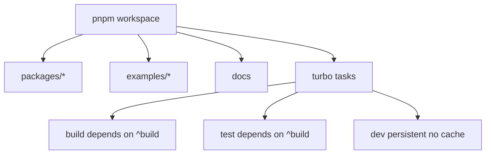

# Technology Stack & Architecture

<cite>
**Referenced Files in This Document**
- [package.json](file://package.json#L4-L40)
- [pnpm-workspace.yaml](file://pnpm-workspace.yaml#L1-L9)
- [turbo.json](file://turbo.json#L1-L25)
- [docs/package.json](file://docs/package.json#L5-L40)
- [packages/protocol/package.json](file://packages/protocol/package.json#L20-L36)
- [packages/react-renderer/package.json](file://packages/react-renderer/package.json#L20-L44)
- [packages/host-svelte/package.json](file://packages/host-svelte/package.json#L24-L53)
</cite>

## Table of Contents

1. [Stack Summary](#stack-summary)
2. [Workspace and Build Architecture](#workspace-and-build-architecture)
3. [Runtime Libraries](#runtime-libraries)
4. [Documentation and Test Tooling](#documentation-and-test-tooling)

## Stack Summary

Uniview is a TypeScript monorepo managed with pnpm workspaces and Turbo. React 19 and Solid provide plugin authoring environments, Svelte 5, React, and Vue demonstrate host rendering, `kkrpc` provides RPC transport, Zod validates protocol payloads, and tsdown builds package outputs. The repository also includes a Next/Fumadocs documentation app and Cypress/Playwright-style E2E tooling.

| Layer | Technologies |
| --- | --- |
| Package language | TypeScript 5.x, ESM packages |
| Plugin frameworks | React 19, Solid |
| Host frameworks | Svelte 5, React 19, Vue 3 |
| RPC | kkrpc catalog dependency |
| Validation | Zod in `@uniview/protocol` |
| Build orchestration | pnpm, Turbo, tsdown, Bun for examples |
| Documentation | Next 16, Fumadocs, Mermaid |
| E2E | Cypress and script-managed fixtures |

**Section sources**

- [package.json](file://package.json#L17-L40)
- [pnpm-workspace.yaml](file://pnpm-workspace.yaml#L1-L9)
- [docs/package.json](file://docs/package.json#L14-L40)

## Workspace and Build Architecture

The workspace includes `packages/*`, `examples/*`, and `docs`; there is no `apps/*` glob. Turbo runs build, lint, type-check, test, and persistent development tasks with dependency-aware ordering. Package-level scripts are intentionally consistent (`build`, `dev`, `test`, `check-types`) while examples add orchestration scripts for bridge/plugin/host processes.

**Diagram sources**

- [pnpm-workspace.yaml](file://pnpm-workspace.yaml#L1-L9)
- [turbo.json](file://turbo.json#L1-L25)

**Section sources**

- [package.json](file://package.json#L4-L15)
- [pnpm-workspace.yaml](file://pnpm-workspace.yaml#L1-L9)
- [turbo.json](file://turbo.json#L4-L24)

## Runtime Libraries

Core packages use workspace dependencies to share protocol and renderer code. `@uniview/protocol` publishes only `dist/index.mjs` and depends on Zod. `@uniview/react-renderer` uses `react-reconciler` from the catalog and peers on React. `@uniview/host-svelte` exposes a Svelte conditional export so Svelte-aware tooling can consume source while default consumers use built output.

**Section sources**

- [packages/protocol/package.json](file://packages/protocol/package.json#L7-L36)
- [packages/react-renderer/package.json](file://packages/react-renderer/package.json#L7-L44)
- [packages/host-svelte/package.json](file://packages/host-svelte/package.json#L7-L53)

## Documentation and Test Tooling

The root package exposes E2E scripts for baseline, Cypress run, and Cypress open modes. The docs package uses Next/Fumadocs with Biome, while the rest of the repository uses Prettier/Turbo conventions. This means documentation authors should expect two formatting domains: Biome inside `docs/` and Prettier elsewhere.

**Section sources**

- [package.json](file://package.json#L4-L25)
- [docs/package.json](file://docs/package.json#L5-L13)
- [docs/package.json](file://docs/package.json#L14-L40)
