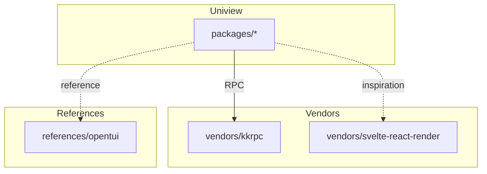

# Vendor Dependencies

<cite>
**Referenced Files in This Document**
- [vendors/kkrpc/](file://vendors/kkrpc/)
- [vendors/svelte-react-render/](file://vendors/svelte-react-render/)
- [references/opentui/](file://references/opentui/)
- [pnpm-workspace.yaml](file://pnpm-workspace.yaml)
- [AGENTS.md](file://AGENTS.md)
</cite>

## Table of Contents

1. [Overview](#overview)
2. [kkrpc](#kkrpc)
3. [svelte-react-render](#svelte-react-render)
4. [opentui](#opentui)
5. [Integration Points](#integration-points)

## Overview

Uniview uses vendor submodules for core dependencies developed in parallel:



**Section sources**

- [AGENTS.md](file://AGENTS.md#L177-L182)

## kkrpc

**Purpose**: Bidirectional RPC communication library

### What It Provides

| Feature | Description |
|---------|-------------|
| `RPCChannel` | TypeScript-first RPC channel |
| 22+ transports | stdio, HTTP, WebSocket, Workers, Electron, Tauri |
| Type safety | Full TypeScript support |
| Validation | Zod, Valibot, ArkType options |
| Streaming | AsyncIterable support |
| Zero-copy | Transferable objects for performance |

### How Uniview Uses It

| Package | Usage |
|---------|-------|
| `react-runtime` | Worker/WebSocket communication |
| `solid-runtime` | Worker/WebSocket communication |
| `host-sdk` | Controller RPC layer |

### Version Management

```yaml
# pnpm-workspace.yaml
catalog:
  kkrpc: ^0.6.7
```

All packages use `kkrpc: "catalog:"` for consistency.

**Section sources**

- [vendors/kkrpc/](file://vendors/kkrpc/)
- [AGENTS.md](file://AGENTS.md#L169-L174)

## svelte-react-render

**Purpose**: Reference implementation for custom React reconcilers rendering to Svelte

### What It Provides

- Custom React reconciler using `react-reconciler`
- React to Svelte 5 component conversion
- Handler registry pattern for events
- Multiple runtime modes (Worker, WebSocket, Main)

### How Uniview Uses It

- **Inspiration**: Uniview's `@uniview/react-renderer` follows similar patterns
- **Handler registry**: Same function-to-ID mapping approach
- **UINode serialization**: Similar serialization pipeline

### Key Concepts Borrowed

```typescript
// Handler registry pattern
const handlerId = registry.register(() => callback());
props._onClickHandlerId = handlerId;
```

**Section sources**

- [vendors/svelte-react-render/](file://vendors/svelte-react-render/)

## opentui

**Purpose**: Terminal UI framework (reference implementation)

### What It Provides

- Core library for terminal user interfaces
- SolidJS and React reconcilers for TUI
- Zig implementation for performance
- Bun-first development

### How Uniview Uses It

- **Reference**: Uniview's `@uniview/tui-renderer` follows similar patterns
- **Non-DOM rendering**: Demonstrates React reconciler for alternative targets
- **Universal approach**: Same plugin code, different rendering target

**Section sources**

- [references/opentui/](file://references/opentui/)

## Integration Points

### Dependency Chain

```
@uniview/protocol (no vendor deps)
    ↓
@uniview/react-renderer (no vendor deps)
    ↓
@uniview/react-runtime → kkrpc
    ↓
@uniview/host-sdk → kkrpc
```

### Import Patterns

```typescript
// Runtime (uses kkrpc)
import { RPCChannel } from "kkrpc";

// Host SDK (uses kkrpc)
import { WorkerParentIO } from "kkrpc/browser";
```

### Catalog Usage

```json
{
  "dependencies": {
    "kkrpc": "catalog:"
  }
}
```

**Section sources**

- [pnpm-workspace.yaml](file://pnpm-workspace.yaml)
- [AGENTS.md](file://AGENTS.md#L169-L174)
