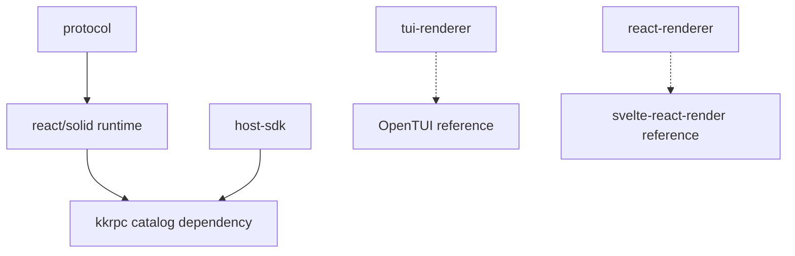

# Vendor Dependencies

<cite>
**Referenced Files in This Document**
- [AGENTS.md](file://AGENTS.md#L172-L185)
- [pnpm-workspace.yaml](file://pnpm-workspace.yaml#L6-L9)
- [packages/react-runtime/package.json](file://packages/react-runtime/package.json#L29-L43)
- [packages/solid-runtime/package.json](file://packages/solid-runtime/package.json#L29-L41)
- [packages/host-sdk/package.json](file://packages/host-sdk/package.json#L28-L48)
- [packages/tui-renderer/src/components.tsx](file://packages/tui-renderer/src/components.tsx#L1-L80)
- [packages/tui-renderer/src/terminal/renderer.ts](file://packages/tui-renderer/src/terminal/renderer.ts#L1-L135)
</cite>

## Table of Contents

1. [Overview](#overview)
2. [kkrpc](#kkrpc)
3. [Svelte React Render Reference](#svelte-react-render-reference)
4. [OpenTUI Reference](#opentui-reference)
5. [Integration Points](#integration-points)

## Overview

Uniview keeps closely related projects under `vendors/` and `references/` for development context. Runtime dependencies still flow through package manifests and the pnpm catalog; vendored/reference directories should not be confused with package-local source.

```mermaid
graph TD
    Protocol[protocol] --> Runtime[react/solid runtime]
    Runtime --> KK[kkrpc catalog dependency]
    HostSDK[host-sdk] --> KK
    TUI[tui-renderer] -.-> OT[OpenTUI reference]
    ReactRenderer[react-renderer] -.-> SRR[svelte-react-render reference]
```

**Diagram sources**

- [AGENTS.md](file://AGENTS.md#L172-L185)
- [pnpm-workspace.yaml](file://pnpm-workspace.yaml#L6-L9)

**Section sources**

- [AGENTS.md](file://AGENTS.md#L172-L185)
- [pnpm-workspace.yaml](file://pnpm-workspace.yaml#L6-L9)

## kkrpc

`kkrpc` is the RPC transport used by plugin runtimes and host controllers. It is version-managed through the pnpm catalog and consumed by React runtime, Solid runtime, and host SDK packages.

**Section sources**

- [AGENTS.md](file://AGENTS.md#L172-L177)
- [pnpm-workspace.yaml](file://pnpm-workspace.yaml#L6-L9)
- [packages/react-runtime/package.json](file://packages/react-runtime/package.json#L29-L43)
- [packages/solid-runtime/package.json](file://packages/solid-runtime/package.json#L29-L41)
- [packages/host-sdk/package.json](file://packages/host-sdk/package.json#L28-L48)

## Svelte React Render Reference

`vendors/svelte-react-render` is retained as a related renderer reference. Uniview's current React renderer is its own package, but the project knowledge base identifies the vendor as useful background for Svelte 5 reconciler patterns and handler registry ideas.

**Section sources**

- [AGENTS.md](file://AGENTS.md#L179-L185)

## OpenTUI Reference

`references/opentui` informs the terminal rendering experiment. Uniview's `@uniview/tui-renderer` defines React-like terminal primitives and a terminal renderer that measures/layouts nodes, tracks focusable inputs/buttons, and emits styled ANSI output.

**Section sources**

- [AGENTS.md](file://AGENTS.md#L179-L185)
- [packages/tui-renderer/src/components.tsx](file://packages/tui-renderer/src/components.tsx#L1-L80)
- [packages/tui-renderer/src/terminal/renderer.ts](file://packages/tui-renderer/src/terminal/renderer.ts#L1-L135)

## Integration Points

The practical dependency chain is: protocol types define the contract, runtimes/host SDK import kkrpc transports, renderers serialize framework trees, and host adapters render protocol nodes. Vendor/reference code should guide design but not leak product-specific concepts into the protocol package.

**Section sources**

- [AGENTS.md](file://AGENTS.md#L130-L177)
- [packages/react-runtime/package.json](file://packages/react-runtime/package.json#L29-L43)
- [packages/host-sdk/package.json](file://packages/host-sdk/package.json#L28-L48)
