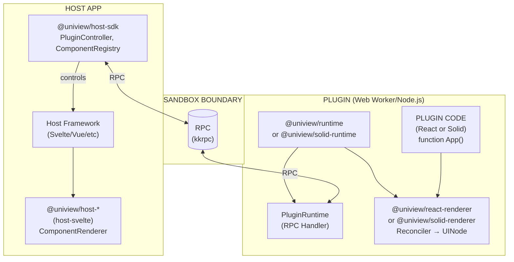
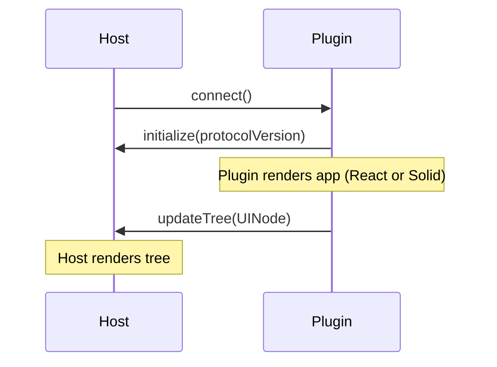
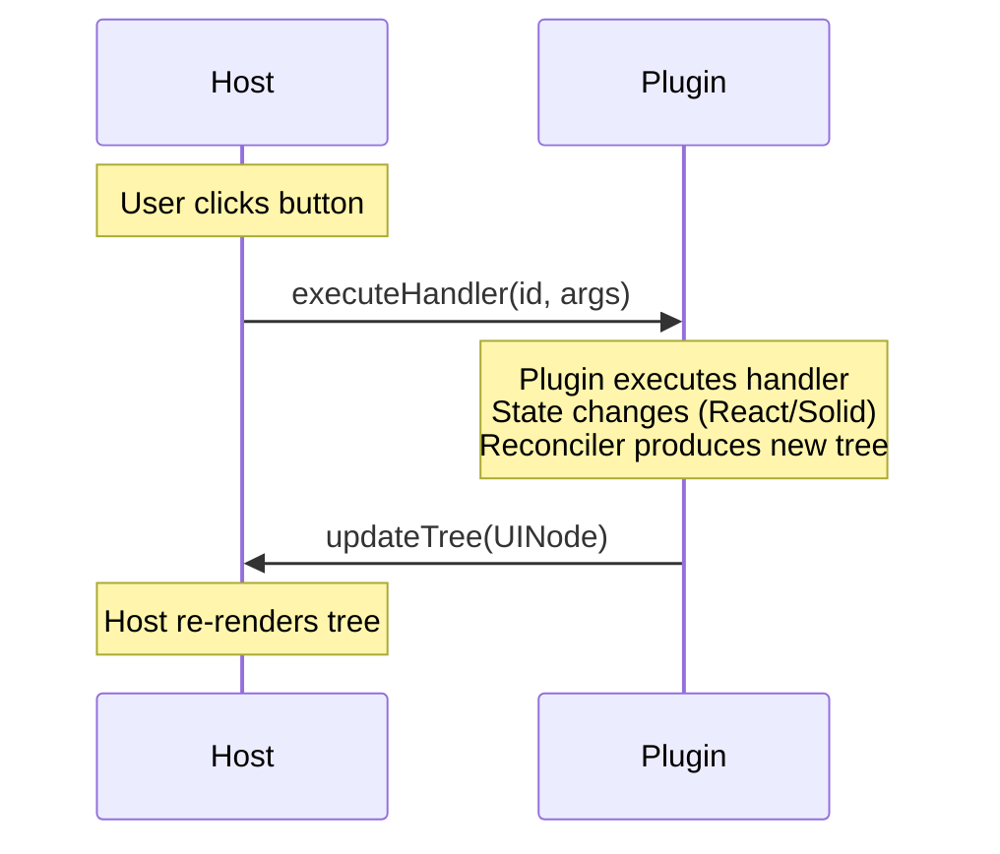
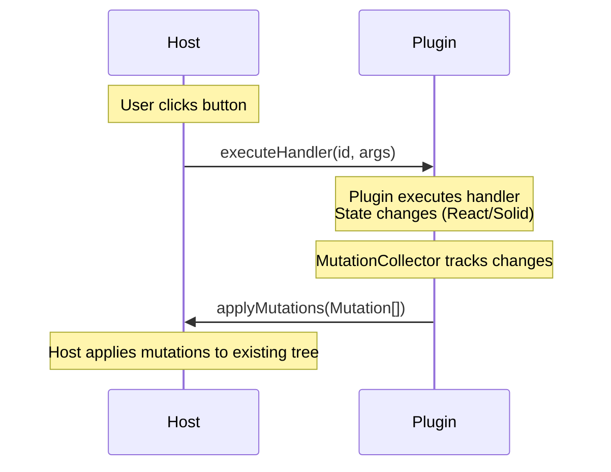
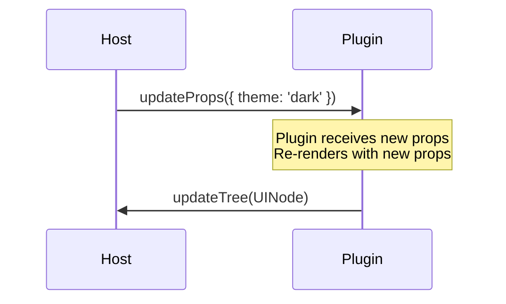
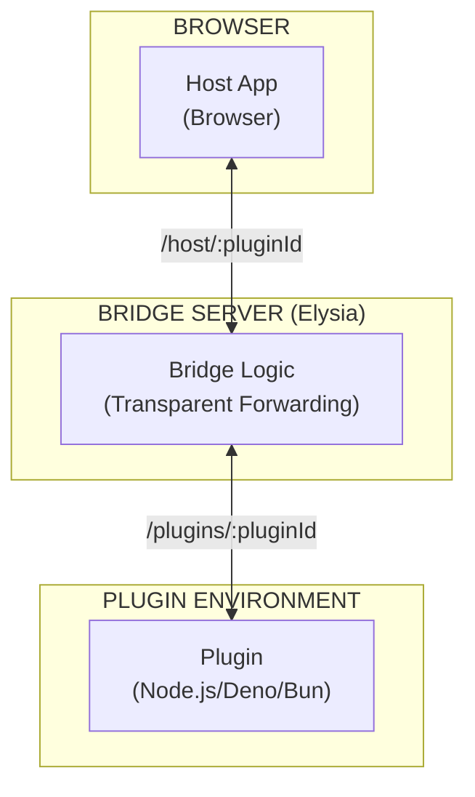
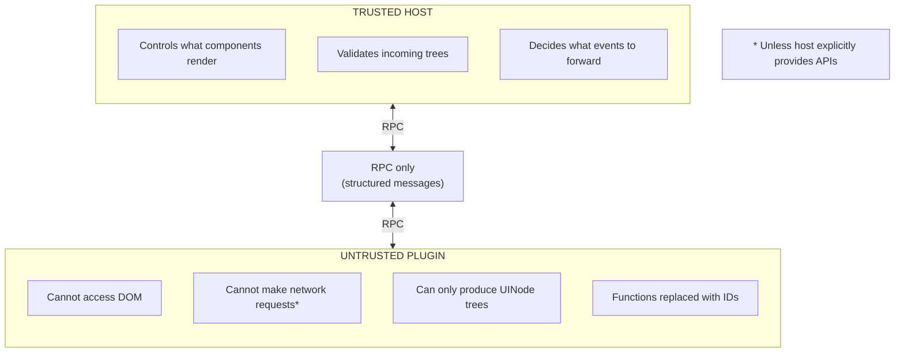

This document explains how Uniview works under the hood - the custom reconcilers (React and Solid), RPC communication, and rendering pipeline.

## High-Level Overview



## Data Flow

### Initialization

When a host loads a plugin:



### State Update (User Interaction)

When a user interacts with the rendered UI:

**Full Tree Mode:**



**Incremental Mode:**



### Props Update (Host-Initiated)

When the host updates plugin props:



## Package Responsibilities

### @uniview/protocol

The shared contract between plugin and host.

**Exports:**

- `UINode` - Serializable tree structure
- `Mutation` - Incremental update mutations (appendChild, removeChild, setText, etc.)
- `HostToPluginAPI` / `PluginToHostAPI` - RPC interfaces
- `LAYOUT_TAGS` - Built-in HTML elements
- `handlerIdProp()` - Handler ID convention
- Zod validators for runtime validation

```typescript
interface UINode {
  id: string;
  type: string; // "div", "Button", "Card", etc.
  props: JSONValue; // Serializable props
  children: (UINode | string)[];
}
```

### @uniview/react-renderer

Custom React reconciler that produces serializable trees.

**Key Components:**

- **HostConfig** - React reconciler configuration
- **InternalNode** - In-memory tree representation
- **serializeTree()** - Converts to protocol UINode
- **MutationCollector** - Collects incremental mutations during commit
- **HandlerRegistry** - Maps functions to IDs

```typescript
import { render, serializeTree, HandlerRegistry } from "@uniview/react-renderer";

const registry = new HandlerRegistry();
const bridge = createRenderBridge();

bridge.subscribe((root) => {
  const tree = serializeTree(root, registry);
  // Send tree to host
});

render(<App />, bridge);
```

### @uniview/solid-renderer

Solid universal renderer that produces the same serializable trees. Uses Babel with `babel-preset-solid` (`generate: "universal"`) to transform Solid JSX into renderer-agnostic calls.

**Key Components:**

- **createRenderer()** - Universal renderer (insert, spread, createElement)
- **SolidNode** - In-memory tree representation (same shape as InternalNode)
- **serializeTree()** - Converts to protocol UINode
- **SolidMutationCollector** - Collects incremental mutations
- **HandlerRegistry** - Maps functions to IDs

Both renderers produce identical `UINode` output — hosts don't need to know which framework the plugin uses.

<Callout type="info">
  Both reconcilers have no DOM dependencies. They work in Web Workers, Node.js,
  Deno, and Bun.
</Callout>

### @uniview/runtime & @uniview/solid-runtime

Plugin bootstrap and lifecycle management. Both packages follow the same API pattern.

**React (`@uniview/runtime`):**

```typescript
import { startWorkerPlugin } from "@uniview/runtime";
startWorkerPlugin({ App });
```

**Solid (`@uniview/solid-runtime`):**

```typescript
import { startSolidWorkerPlugin } from "@uniview/solid-runtime";
startSolidWorkerPlugin({ App });
```

Both runtimes also provide WebSocket client entries for server-side plugins via `/ws-client` subpath exports.

### @uniview/host-sdk

Framework-agnostic host infrastructure.

**Exports:**

- `PluginController` - Unified interface for all modes
- `createWorkerController()` - Web Worker mode
- `createWebSocketController()` - WebSocket mode
- `createMainController()` - Main thread mode
- `createComponentRegistry()` - Custom component mapping
- `MutableTree` - Applies incremental mutations to UINode tree

```typescript
const controller = createWorkerController({
  pluginUrl: "/plugin.js",
  initialProps: { theme: "dark" },
});

controller.subscribe((tree) => {
  // Render tree
});

await controller.connect();
```

### @uniview/host-svelte

Svelte 5 rendering adapter.

**Components:**

- `PluginHost` - Main lifecycle component
- `ComponentRenderer` - Recursive tree renderer

```svelte
<PluginHost {controller} {registry}>
  {#snippet loading()}
    <p>Loading...</p>
  {/snippet}
</PluginHost>
```

## Key Design Decisions

### 1. Protocol is Product-Agnostic

The protocol defines `UINode` with `type: string`. No hardcoded component types.

```typescript
// Protocol doesn't know about "Button" or "Card"
interface UINode {
  type: string; // Any string - products define their own
  // ...
}
```

Products register their own components:

```typescript
registry.register("Button", MyButton);
registry.register("Card", MyCard);
registry.register("CustomWidget", MyWidget);
```

### 2. Layout Tags as Primitives

HTML-like elements are always available:

```typescript
const LAYOUT_TAGS = [
  "div",
  "span",
  "p",
  "section",
  "header",
  "footer",
  "h1",
  "h2",
  "h3",
  "h4",
  "h5",
  "h6",
  "ul",
  "ol",
  "li",
  "br",
  "hr",
  "button",
  "input",
  "form",
  "label",
  "a",
  // ...
];
```

Hosts render these as native elements without registration.

### 3. Handler ID Convention

Functions can't cross RPC boundaries. The convention:

1. Plugin registers handler: `onClick={() => ...}` → ID `"h_abc123"`
2. Serialization: `{ onClick: fn }` → `{ _onClickHandlerId: "h_abc123" }`
3. Host creates proxy: `onclick: () => controller.execute("h_abc123")`

```typescript
// Protocol helpers
import {
  handlerIdProp,
  isHandlerIdProp,
  extractEventName,
} from "@uniview/protocol";

handlerIdProp("onClick"); // "_onClickHandlerId"
isHandlerIdProp("_onClickHandlerId"); // true
extractEventName("_onClickHandlerId"); // "onClick"
```

### 4. Worker-First Architecture

Primary mode is Web Worker for security:

- Plugin code runs in sandboxed Worker
- No direct DOM access
- Communication only via structured RPC
- Host controls what gets rendered

### 5. Thin Framework Adapters

All controller logic lives in `host-sdk`. Adapters only handle rendering:

```
host-sdk (400 lines)     ← All the logic
host-svelte (150 lines)  ← Just Svelte rendering
host-vue (150 lines)     ← Just Vue rendering
```

## Bridge Architecture (WebSocket Mode)

In WebSocket mode, Uniview uses a **Bridge Server** pattern to facilitate communication between the browser host and the plugin running in a server-side environment (Node.js, Deno, Bun).

### The Bridge Pattern

Unlike the traditional approach where each plugin runs its own WebSocket server, Uniview uses a single Elysia-based bridge server (provided by `@uniview/bridge-server`). This simplifies deployment and networking by multiplexing all plugin connections through a single port.



### Key Characteristics

- **Plugins as Clients**: Plugins connect **as clients** to the bridge server. They do not need to manage their own server lifecycle or open public ports.
- **Transparent Byte Forwarding**: The bridge server does not parse or inspect the RPC messages. It simply forwards raw bytes between the matched host and plugin pairs based on the `pluginId`.
- **Simplified Deployment**: Only the bridge server needs a stable, reachable address. Plugins can run behind NAT or in ephemeral environments as long as they can reach the bridge.
- **Unified Port**: All communication (multiple plugins, multiple hosts) happens over a single port (default `:3000`), making it easier to configure firewalls and reverse proxies.

## Security Model



<Callout type="warn">
  WebSocket mode and Main Thread mode do NOT provide sandbox isolation. Use
  Worker mode for untrusted plugins.
</Callout>

## Extension Points

### Custom Components

Define product-specific primitives:

```typescript
// Your product's API
registry.register("CommandPalette", CommandPalette);
registry.register("FileTree", FileTree);
registry.register("Terminal", Terminal);
```

### Custom Transports

Support additional communication channels:

```typescript
// Built-in
createWorkerController({ pluginUrl });
createWebSocketController({ serverUrl });

// Potential extensions
createIframeController({ frameUrl });
createElectronController({ processId });
```

### Custom APIs

Expose additional functionality to plugins via RPC extensions:

```typescript
// Host exposes file system API
controller.expose({
  readFile: (path) => fs.readFileSync(path),
  writeFile: (path, data) => fs.writeFileSync(path, data),
});

// Plugin uses it
const content = await hostApi.readFile("/config.json");
```
