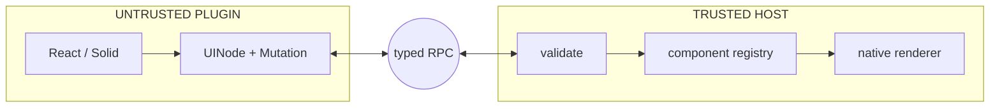

<!-- slide:01 -->

<DeckFrame eyebrow="The promise" title="Write once. Render anywhere." subtitle="Author a plugin in React or Solid. Render it to the DOM, a terminal, or a native macOS window." page="01 / 18">

<div style="display:grid;grid-template-columns:1.05fr .95fr;gap:28px;align-items:center;height:335px">
  <div class="uv-stack">
    <div class="uv-big">One component tree.<br><span class="uv-gradient-text">Every surface.</span></div>
    <p class="uv-copy">The plugin never touches the DOM. The host never needs to understand the plugin framework.</p>
    <div class="uv-chip" style="width:max-content">open source · protocol first · framework agnostic</div>
  </div>
  <div class="uv-panel" v-motion :initial="{x:52,opacity:0}" :enter="{x:0,opacity:1,transition:{duration:500}}">

```tsx {1|3-7|all}
function Counter() {
  const [count, setCount] = useState(0)
  return (
    <button onClick={() => setCount(count + 1)}>
      Count: {count}
    </button>
  )
}
```

  </div>
</div>

</DeckFrame>

<!--
Start with the experience Uniview ultimately wants to give a developer: you just write an ordinary React or Solid component. No special JSON UI dialect, no host object handed in.

[click] It owns its own state and events, and it composes like any component you would already write.

[click] But that exact same source can land on the browser DOM, a terminal, or a native macOS window. How the seam in the middle is built is what we will unpack today.
-->

---
title: "The framework-coupling problem"
---

<!-- slide:02 -->

<DeckFrame eyebrow="The problem" title="A normal plugin inherits its host's world" subtitle="Once plugin code imports the host framework or touches the DOM, portability and isolation disappear together." page="02 / 18">

<div class="uv-grid-2">
  <div>
    <div class="uv-code-label">plugin.ts</div>

```ts {1-4|2|3|all}
export function activate(host: SvelteHost) {
  const root = document.querySelector('#plugin-root')!
  root.innerHTML = '<button>Run</button>'
  root.onclick = () => host.runCommand('build')
}
```

  </div>
  <div class="uv-stack">
    <div v-click class="uv-panel"><div class="uv-kicker uv-red">Host lock-in</div><p class="uv-copy" style="font-size:15px;margin-top:7px">A React plugin cannot simply render inside a Svelte or native host.</p></div>
    <div v-click class="uv-panel"><div class="uv-kicker uv-amber">No sandbox</div><p class="uv-copy" style="font-size:15px;margin-top:7px">Direct DOM access means the plugin shares the application's authority.</p></div>
    <div v-click class="uv-panel"><div class="uv-kicker uv-violet">No new surface</div><p class="uv-copy" style="font-size:15px;margin-top:7px">There is no <code>document</code> in a Worker, terminal, or AppKit process.</p></div>
  </div>
</div>

</DeckFrame>

<!--
The most direct way to build a plugin is to hand the host object straight to the plugin, or to let the plugin touch the DOM itself.

[click] Problem one is framework lock-in: the plugin is welded to the component lifecycle of Svelte, React, or Vue. [click] Problem two is that the security boundary disappears — once the plugin holds document, it holds the entire page. [click] Problem three is that this code simply cannot move to a Worker, a terminal, or AppKit, because none of those environments have a DOM.

So Uniview is not trying to wrap yet another component library. It is looking for a boundary that is smaller and more universal than the DOM.
-->

---
title: "A serializable seam"
---

<!-- slide:03 -->

<DeckFrame eyebrow="The seam" title="Move the boundary from DOM nodes to data" subtitle="A plugin produces a small serializable tree. Each host decides how that tree becomes native UI." page="03 / 18">

<div class="uv-grid-2" style="grid-template-columns:.95fr 1.05fr">
  <div class="uv-panel">

```ts {1-6|2|3-4|5|all}
interface UINode {
  id: string
  type: string
  props: JSONValue
  children: (UINode | string)[]
}
```

  </div>
  <div class="uv-stack">
    <div class="uv-big" style="font-size:36px">The plugin sends <span v-mark.underline.purple="1">meaning</span>,<br>not pixels.</div>
    <div v-click class="uv-callout"><strong><code>type</code> stays open.</strong> A host can map <code>button</code>, <code>Table</code>, or <code>CommandPalette</code> to its own primitives.</div>
    <div v-click class="uv-callout"><strong>Everything is serializable.</strong> The tree can cross a Worker or process boundary and be validated.</div>
  </div>
</div>

</DeckFrame>

<!--
The boundary Uniview picks is called UINode, and it is tiny: a stable id, a string type, serializable props, and children.

[click] The important part is that type is not a hardcoded enum. A host gets to decide whether a button becomes an HTMLButtonElement, a terminal cell, or an NSButton. [click] And because the whole tree is just data, it can cross a Worker or a process boundary, and the host can validate its schema on the way in.

The plugin sends the meaning of the interface, not the pixels some platform already painted.
-->

---
title: "The universal pipeline"
---

<!-- slide:04 -->

<DeckFrame eyebrow="How it works" title="One pipeline, four replaceable pieces" subtitle="Only the UINode + Mutation contract is shared. Frameworks, transports, and surfaces remain adapters." page="04 / 18">

<div class="uv-click-anchors"><span v-click /><span v-click /><span v-click /><span v-click /></div>
<UniversalPipeline :step="Math.min($nav.clicks, 4)" />

<div v-click class="uv-callout" style="margin-top:16px;text-align:center">
  A new plugin framework is a new reconciler. A new surface is a new host renderer. <strong>Zero protocol change.</strong>
</div>

</DeckFrame>

<!--
The full path breaks into four pieces.

[click] The first piece is the plugin code, written in React or Solid. [click] The second is a custom reconciler that never creates DOM — it produces UINode instead. [click] The third is kkRPC, carrying mutations and event calls across the wire. [click] The fourth is the host renderer, mapping that same tree onto the current platform.

[click] The payoff of this split: adding a new framework only takes a renderer package, and adding a new target only takes a host package. The protocol never has to know about either side.
-->

---
title: "The protocol rejects functions"
---

<!-- slide:05 -->

<DeckFrame eyebrow="Type safety" title="The boundary is enforced at build time" subtitle="JSONValue intentionally rejects functions: behavior needs a reference, not fake serialization." page="05 / 18">

<div class="uv-twoslash-compact" style="max-width:820px;margin:0 auto">

```ts twoslash
// @errors: 2322
type Primitive = string | number | boolean | null
type JSONValue = Primitive | JSONValue[]
  | { [key: string]: JSONValue }

interface UINode {
  id: string; type: string; props: JSONValue
  children: (UINode | string)[]
}

declare const save: () => void
const node: UINode = {
  id: 'save', type: 'button', props: { onClick: save },
  children: ['Save'],
}
```

</div>

<FocusRing :at="1" :until="2" :x="78" :y="160" :width="820" :height="62" tone="violet" />
<FocusRing :at="2" :until="3" :x="78" :y="242" :width="820" :height="82" tone="sky" />
<FocusRing :at="3" :x="78" :y="342" :width="820" :height="132" tone="red" />

</DeckFrame>

<!--
This type constraint is not a weakness — it is the architecture's guardrail.

[click] A UINode's props must be a JSONValue. [click] The moment we try to drop an onClick function straight in, Twoslash shows a real TypeScript error, right here. [click] A function cannot be structured-cloned and cannot be JSON-serialized faithfully, so Uniview turns it into a handler ID instead. Let us follow the full path on the next slide.
-->

---
title: "Component to UINode"
---

<!-- slide:06 -->

<DeckFrame eyebrow="Reconciliation" title="JSX is authoring syntax. UINode is the wire format." subtitle="React and Solid renderers compile familiar components into the same framework-neutral tree." page="06 / 18">

<div style="max-width:840px;margin:0 auto">

````md magic-move {lines: true}
```tsx {1-5|2-4|all}
<button className="primary" onClick={save}>
  Save
</button>
```
```ts {1-7|2-4|5|all}
{
  id: 'n_42',
  type: 'button',
  props: {
    className: 'primary',
    _onClickHandlerId: 'h_7f2'
  },
  children: ['Save']
}
```
````

</div>

<div v-click class="uv-callout" style="margin-top:15px;text-align:center">The host receives no JSX, no component instance, and no plugin function.</div>

</DeckFrame>

<!--
The plugin author still writes the JSX they already know.

[click] The reconciler assigns a stable id and keeps the type and the serializable props. [click] When it reaches onClick, it registers the original function on the plugin side and writes only a handler ID into the UINode. [click] Children are converted recursively too.

[click] So the host receives no JSX, no React component instance, and no plugin function — only a tree of data it can validate.
-->

---
title: "Events travel back"
---

<!-- slide:07 -->

<DeckFrame eyebrow="Bidirectional interaction" title="A click returns to the function that created it" subtitle="Functions never cross RPC; handler IDs do. The host owns native input; the plugin owns state." page="07 / 18">

<div class="uv-click-anchors"><span v-click /><span v-click /><span v-click /><span v-click /><span v-click /></div>
<HandlerJourney :step="Math.min($nav.clicks, 5)" />

<div v-click class="uv-callout" style="margin-top:15px;text-align:center">
  The callback keeps its natural component API without crossing the boundary as executable code.
</div>

</DeckFrame>

<!--
When a user clicks a native button, the event starts on the host side.

[click] The host fires onClick. [click] It finds the handler ID h_7f2 sitting in the props. [click] It calls executeHandler over typed RPC. [click] The registry on the plugin side recovers the original function and updates React state or a Solid signal. [click] The reconciler sends back only the resulting mutation.

[click] The callback still feels completely natural to use, yet executable code never once crossed the security boundary.
-->

---
title: "Incremental mutations"
---

<!-- slide:08 -->

<DeckFrame eyebrow="Efficiency" title="State changes do not require a whole-tree replay" subtitle="Full-tree mode is the simple baseline; incremental mode sends only append, remove, props, or text mutations." page="08 / 18">

<div class="uv-grid-2" style="align-items:center">
  <div>

````md magic-move {lines: true}
```ts {1-4|all}
rpc.updateTree({
  type: 'Counter',
  children: [/* the whole tree */],
})
```
```ts {1-5|2-4|all}
rpc.applyMutations([{
  type: 'setText',
  nodeId: 'count-label',
  text: '43',
}])
```
````

  </div>
  <div class="uv-stack">
    <div class="uv-stat"><strong class="uv-violet">Full tree</strong><span>Easy to reason about; suitable for small trees and simple apps.</span></div>
    <div v-click class="uv-stat"><strong class="uv-green">Mutation[]</strong><span>Stable IDs let the host update the existing tree in place.</span></div>
    <div v-click class="uv-callout"><strong>High-frequency UI stays local.</strong> Hover, focus, scrolling, and animation should not become an RPC stream.</div>
  </div>
</div>

</DeckFrame>

<!--
The simplest possible implementation just sends the whole tree every time, and Uniview keeps that full-tree mode around.

[click] But once you have stable ids, incremental mode can send only the mutations that changed — setText, setProps, appendChild, removeChild. [click] The host's MutableTree applies each one to the existing node, with no need to rebuild the whole thing.

[click] Higher-frequency interaction — hover, focus, scroll, animation — stays local to the host. RPC carries semantic change, not every single frame.
-->

---
title: "The sandbox boundary"
---

<!-- slide:09 -->

<DeckFrame eyebrow="Security model" title="The plugin can describe UI—not own the page" subtitle="The trusted host validates the tree, chooses renderable components, and decides which capabilities to expose." page="09 / 18">

<div style="display:grid;grid-template-columns:1fr 1.15fr;gap:20px;align-items:center">



  <div class="uv-stack">
    <div v-click class="uv-panel"><div class="uv-kicker uv-green">Plugin cannot</div><p class="uv-small" style="margin-top:7px">touch <code>window</code>, <code>document</code>, or arbitrary host components in Worker mode</p></div>
    <div v-click class="uv-panel"><div class="uv-kicker uv-sky">Host controls</div><p class="uv-small" style="margin-top:7px">validation, the component registry, event forwarding, and exposed APIs</p></div>
    <div v-click class="uv-panel"><div class="uv-kicker uv-amber">Boundary matters</div><p class="uv-small" style="margin-top:7px">WebSocket and main-thread modes provide different isolation guarantees</p></div>
  </div>
</div>

</DeckFrame>

<!--
UINode is not only a portability layer — it is also a capability boundary.

[click] A plugin inside a Worker has no window and no document, so it cannot reach around the host to touch the page. [click] Once the host receives the tree it can validate the structure, allow only the components registered in its registry, and decide exactly which events and APIs flow back to the plugin. [click] But be precise here: isolation strength differs by runtime mode. A Worker is a real sandbox, WebSocket is a process boundary, and main-thread is only a development mode.
-->

---
title: "Three runtime modes"
---

<!-- slide:10 -->

<DeckFrame eyebrow="Runtime choices" title="Same host API, three execution boundaries" subtitle="Choose isolation and capabilities without rewriting the component or host controller." page="10 / 18">

<div class="uv-click-anchors"><span v-click /><span v-click /><span v-click /></div>
<RuntimeModes :active="Math.min($nav.clicks, 3)" />

<div v-click class="uv-small" style="margin-top:14px;text-align:center">The WebSocket bridge multiplexes plugins through one stable endpoint; plugins connect as clients.</div>

</DeckFrame>

<!--
Uniview has three runtime modes today.

[click] The Web Worker is the production path for untrusted browser plugins, with a full sandbox. [click] The WebSocket bridge runs the plugin on Node, Deno, or Bun — the plugin connects to the bridge as a client, so it can live in another process, or even on another machine. [click] Main-thread has no isolation at all; it is only for fast development and debugging.

[click] To the host, all three expose the very same PluginController. What you switch is the transport and the security boundary, never the application code.
-->

---
title: "One tree, three targets"
---

<!-- slide:11 -->

<DeckFrame eyebrow="Render targets" title="Each surface draws with its own native primitives" subtitle="The protocol stays the same; only the final renderer changes." page="11 / 18">

<div class="uv-click-anchors"><span v-click /><span v-click /><span v-click /></div>
<TargetTriptych :active="Math.min($nav.clicks, 3)" />

<div v-click class="uv-callout" style="margin-top:13px;text-align:center">Windows and HarmonyOS are planned—the extension point is already the host renderer seam.</div>

</DeckFrame>

<!--
This tree already has three real classes of target.

[click] The web host can be Svelte, Vue, or React, and it ends up creating actual DOM elements. [click] The terminal host draws with a cell buffer, Yoga layout, styled text, and sub-cell charts. [click] The AppKit host maps UINode onto NSViews and uses stable ids for in-place reconciliation.

[click] Windows and HarmonyOS are still on the roadmap, but where they plug in is already obvious: add a host renderer — do not touch the plugin or the protocol.
-->

---
title: "Thin host adapters"
---

<!-- slide:12 -->

<DeckFrame eyebrow="Host integration" title="A host adapter should be boring" subtitle="Connection and mutable-tree logic live in host-sdk; the framework layer recursively renders nodes." page="12 / 18">

<div class="uv-grid-2" style="grid-template-columns:1.15fr .85fr">
  <div>
    <div class="uv-code-label">Host.svelte</div>

```svelte {1-3|5-8|10|all}
<script lang="ts">
  import { PluginHost } from '@uniview/host-svelte'
  import { createWorkerController } from '@uniview/host-sdk'

  const controller = createWorkerController({
    pluginUrl: '/plugins/counter.js',
    initialProps: { theme: 'dark' },
  })
</script>

<PluginHost {controller} />
```

  </div>
  <div class="uv-stack">
    <div v-click class="uv-panel"><div class="uv-kicker">host-sdk</div><p class="uv-small" style="margin-top:7px">controller lifecycle · RPC · MutableTree · registry</p></div>
    <div v-click class="uv-panel"><div class="uv-kicker uv-violet">host-svelte</div><p class="uv-small" style="margin-top:7px">recursive rendering and native event proxying</p></div>
    <div v-click class="uv-panel"><div class="uv-kicker uv-green">local interaction</div><p class="uv-small" style="margin-top:7px">focus, hover, scrolling, and native accessibility stay in the host</p></div>
  </div>
</div>

</DeckFrame>

<!--
From the host side, wiring a plugin in should not be complicated.

[click] createWorkerController owns the connection, the lifecycle, and the tree updates. [click] The Svelte adapter just recursively renders UINode and proxies native events back to the controller. [click] Hover, focus, scroll, and accessibility all stay local to the host that actually owns the UI.

The more boring this adapter is, the better — the shared logic already lives in host-sdk instead of being copied into every framework.
-->

---
title: "Real renderer proof"
---

<!-- slide:13 -->

<DeckFrame eyebrow="Real frames, not mockups" title="The terminal host is already rendering real applications" subtitle="Every image is an SVG snapshot emitted by the real component tree through SvgCellSurface." page="13 / 18">

<div class="uv-click-anchors"><span v-click /><span v-click /><span v-click /><span v-click /><span v-click /><span v-click /></div>
<ProofGallery :active="Math.min($nav.clicks, 6)" />

</DeckFrame>

<!--
The best proof of an architecture is not another architecture diagram — it is what the thing can already draw.

[click] This is htop, with live CPU and memory data. [click] This is lazygit, multi-panel and interactive. [click] These are gauges, bar charts, and histograms. [click] This is 2048, written in Solid, with a trained AI playing it. [click] This is an oscilloscope drawn at Braille sub-cell resolution. [click] And this is an image viewer that turns a raster image into half-block cells.

None of these are Figma mockups. They are snapshots produced directly by the same real component tree — we simply swapped the terminal's AnsiCellSurface for an SvgCellSurface.
-->

---
title: "The TUI is the same architecture"
---

<!-- slide:14 -->

<DeckFrame eyebrow="Terminal host" title="TUI is a host—not a separate component model" subtitle="React and Solid bindings emit the shared UINode tree; host-tui turns it into layout, cells, diffs, ANSI, or SVG." page="14 / 18">

<div class="uv-grid-2">
  <div>
    <div class="uv-code-label">monitor.tsx</div>

```tsx {1|3-7|9-15|all}
import { Panel, Text, Table } from '@uniview/tui-react'

export function Monitor({ processes }) {
  const [selected, setSelected] = useState(0)
  return (
    <Panel title="Processes">
      <Text bold>CPU / MEM</Text>
      <Table
        columns={processColumns}
        rows={processes}
        selectedIndex={selected}
        onSelect={setSelected}
        height={12}
      />
    </Panel>
  )
}
```

  </div>
  <div class="uv-stack">
    <div v-click class="uv-panel"><div class="uv-kicker uv-violet">Bindings</div><p class="uv-small" style="margin-top:7px"><code>tui-react</code> and <code>tui-solid</code> produce equivalent UINode output.</p></div>
    <div v-click class="uv-panel"><div class="uv-kicker uv-sky">Host</div><p class="uv-small" style="margin-top:7px"><code>host-tui</code> maps protocol nodes and mutations into the renderer.</p></div>
    <div v-click class="uv-panel"><div class="uv-kicker uv-green">Core</div><p class="uv-small" style="margin-top:7px">Yoga layout → paint → cell diff → ANSI, SVG, DOM, or memory surface.</p></div>
  </div>
</div>

</DeckFrame>

<!--
Let me also clear up an easy misconception: the TUI is not a separate renderer model.

[click] tui-react and tui-solid both express their components as the shared UINode. [click] host-tui consumes the very same tree and mutations and turns them into a scene the terminal renderer understands. [click] tui-core handles Yoga layout, paint, and cell diff, and can finally emit ANSI, SVG, a DOM surface, or a memory surface.

Because that whole pipeline is unified, React and Solid can produce byte-identical SVG for the same app.
-->

---
title: "The Prime Directive"
---

<!-- slide:15 -->

<DeckFrame eyebrow="The Prime Directive" title="A renderer with no opinions of its own" subtitle="The primitive set stays bounded while applications, frameworks, and visual identities keep growing." page="15 / 18">

<div class="uv-click-anchors"><span v-click /><span v-click /><span v-click /></div>
<PrimeDirective :active="Math.min($nav.clicks, 3)" />

<div v-click class="uv-callout" style="margin-top:14px;text-align:center">
  New framework? Add a binding. New product component? Write plugin code. <span v-mark.circle.green="4">New platform?</span> Add a host renderer.
</div>

</DeckFrame>

<!--
Uniview calls this set of constraints the Prime Directive.

[click] Framework-agnostic: the protocol and the host do not know that React or Solid exists. [click] App-agnostic: a sidebar, a command palette, a table are all components — not primitives endlessly stuffed into the core. [click] Brand-agnostic: the renderer invents no color, no corner radius, no gradient; it only draws the Style IR the plugin sends.

[click] So a new framework adds a binding, a new product capability writes a component, and a new platform adds a host renderer. The three axes of extension never contaminate one another.
-->

---
title: "React and Solid parity"
---

<!-- slide:16 -->

<DeckFrame eyebrow="Authoring choice" title="React or Solid in. Identical protocol out." subtitle="The host cannot tell which framework authored the tree—and should never need to." page="16 / 18">

<div class="uv-grid-2">
  <div>
    <div class="uv-code-label">React</div>

```tsx {1-2|4-7|all}
const [count, setCount] = useState(0)

return (
  <Button onClick={() => setCount(c => c + 1)}>
    {count}
  </Button>
)
```

  </div>
  <div>
    <div class="uv-code-label">Solid</div>

```tsx {1-2|4-7|all}
const [count, setCount] = createSignal(0)

return (
  <Button onClick={() => setCount(c => c + 1)}>
    {count()}
  </Button>
)
```

  </div>
</div>

<div v-click class="uv-stat-grid" style="margin-top:14px">
  <div class="uv-stat"><strong class="uv-violet">React</strong><span>Custom reconciler and familiar hooks.</span></div>
  <div class="uv-stat"><strong class="uv-sky">Solid</strong><span>Universal renderer and fine-grained signals.</span></div>
  <div class="uv-stat"><strong class="uv-green">Same UINode</strong><span>Host and protocol remain unchanged.</span></div>
</div>

</DeckFrame>

<!--
A plugin author can pick React or Solid per project.

[click] The state models differ — React uses hooks, Solid uses signals — but the component API is basically identical. [click] Both reconcilers end up emitting the same UINode and the same handler-ID convention. [click] The host has no idea which framework wrote the tree, and it should never need to.

Solid also brings a smaller plugin runtime, while React keeps its mature ecosystem — and that choice never leaks into the protocol or the host.
-->

---
title: "Boot the plugin"
---

<!-- slide:17 -->

<DeckFrame eyebrow="Quickstart" title="One bootstrap call defines the boundary" subtitle="The component stays ordinary; the runtime decides where it executes and how it reaches the host." page="17 / 18">

<div style="max-width:860px;margin:0 auto">

````md magic-move {lines: true}
```ts {1-4|3|all}
// Browser sandbox
import { startWorkerPlugin } from '@uniview/react-runtime'
import App from './App'
startWorkerPlugin({ App, mode: 'incremental' })
```
```ts {1-7|3-6|all}
// Node / Deno / Bun process
import { connectToHostServer } from '@uniview/react-runtime/ws-client'
connectToHostServer({
  App,
  serverUrl: 'ws://localhost:3000',
  pluginId: 'system-monitor',
})
```
````

<div v-click class="uv-callout" style="margin-top:14px;text-align:center">Same <code>App</code>. Different boundary. Same host-side controller contract.</div>
</div>

</DeckFrame>

<!--
When you actually boot a plugin, the whole boundary collapses into a single bootstrap call.

[click] In browser production you use startWorkerPlugin and turn on incremental mode. [click] If the plugin needs the system capabilities of Node, Deno, or Bun, you let it connect as a client to the WebSocket bridge. [click] The App component does not change at all, and the host still faces the very same controller contract.

This is the developer experience Uniview most wants to protect: the architectural boundary is explicit, but the everyday component code stays completely ordinary.
-->

---
title: "One tree, every surface"
---

<!-- slide:18 -->

<DeckFrame eyebrow="Uniview" title="One tree. Every surface." subtitle="A small protocol turns framework choice, runtime isolation, and render targets into independent decisions." page="18 / 18">

<div style="display:grid;grid-template-columns:1.08fr .92fr;gap:26px;align-items:center;height:320px">
  <div class="uv-stack">
    <div class="uv-big">Your plugin owns the <span class="uv-violet">idea</span>.<br>The host owns the <span class="uv-sky">surface</span>.</div>
    <p class="uv-copy">React or Solid → UINode + Mutation → typed RPC → DOM, TUI, AppKit, and whatever comes next.</p>
  </div>
  <div class="uv-stack">
    <div v-click class="uv-panel"><div class="uv-kicker uv-green">Portable</div><p class="uv-small" style="margin-top:6px">One authoring model across frameworks and platforms.</p></div>
    <div v-click class="uv-panel"><div class="uv-kicker uv-sky">Isolated</div><p class="uv-small" style="margin-top:6px">The plugin describes UI through a controlled boundary.</p></div>
    <div v-click class="uv-panel"><div class="uv-kicker uv-violet">Extensible</div><p class="uv-small" style="margin-top:6px">New bindings and hosts do not expand the protocol.</p></div>
  </div>
</div>

</DeckFrame>

<!--
Let us pull the whole path back together.

[click] Uniview lets the plugin own the idea of the interface, and lets the host own the real platform surface. [click] UINode and Mutation hold the two sides apart, and typed RPC connects their state and events. [click] So framework, runtime isolation, and render target become three dimensions you get to choose independently.

Today there is DOM, TUI, and AppKit; when the next surface arrives, the plugin code will not need to know. One tree, every surface.
-->
